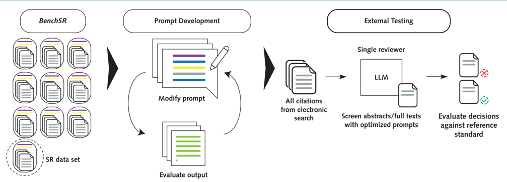

## Annals of Internal Medicine RESEARCH AND REPORTING METHODS

## Development of Prompt Templates for Large Language Model -Driven Screening in Systematic Reviews

Christian Cao, MD(i)*; Jason Sang, BSc*; Rohit Arora, BSc, PhD(i)*; David Chen, BSc, MD(i); Robert Kloosterman, BSc, MSc, MD(i); Matthew Cecere, BSc, MD(i); Jaswanth Gorla, BSc, MD(i), MHI; Richard Saleh, BSc, MA; Ian Drennan, PhD; Bijan Teja, MD, MBA, PhD(i); Michael Fehlings, MD, PhD; Paul Ronksley, PhD; Alexander A. Leung, MD, MPH; Dany E. Weisz, MD; Harriet Ware, MSc; Mairead Whelan, MPhil; David B. Emerson, PhD; Rahul K. Arora, DPhil † ; and Niklas Bobrovitz, MSc, MD, DPhil †

Background: Systematic reviews (SRs) are hindered by the initial rigorous article screen, which delays access to reliable information synthesis.

Objective: To develop generic prompt templates for large language model (LLM) -driven abstract and full-text screening that can be adapted to different reviews.

Design: Diagnostic test accuracy.

Setting: 48425 citations were tested for abstract screening across 10 SRs. Full-text screening evaluated all 12690 freely available articles from the original search. Prompt development used the GPT4-0125preview model (OpenAI).

Participants:

None.

Measurements: Large language models were prompted to include or exclude articles based on SR eligibility criteria. Model outputs were compared with original SR author decisions after full-text screening to evaluate performance (accuracy, sensitivity, and speci /uniFB01 city).

Results: Optimized prompts using GPT4-0125-preview achieved a weighted sensitivity of 97.7% (range, 86.7% to 100%) and speci /uniFB01 city of 85.2% (range, 68.3% to 95.9%) in abstract screening and weighted sensitivity of 96.5% (range, 89.7% to 100.0%) and speci /uniFB01 city of 91.2% (range, 80.7% to 100%) in full-text screening

S ystematic reviews (SRs) are rigorous forms of knowledge synthesis that involve the gathering, critical appraisal, and analysis of evidence. As the gold standard in evidence-based practice, SRs bolster decision making across various domains, including medicine, business, and agriculture, among others (1). However, SRs are resource intensive, typically requiring 1 year and upwards of $100000 to complete due to the comprehensive processes of conducting detailed searches, screening articles, extracting data, analyzing /uniFB01 ndings, and report writing (2 -4). The screening phase is particularly demanding and typically involves 2 investigators working independently, and in duplicate, to identify articles that meet prede /uniFB01 ned eligibility criteria through title and abstract and then full-text screening stages (1, 5). Despite a growing catalog of tools and resources (6), SR automation remains elusive. Existing tools only supplement human work /uniFB02 ows, lack the performance across 10 SRs. In contrast, zero-shot prompts had poor sensitivity (49.0% abstract, 49.1% full-text). Across LLMs, Claude-3.5 (Anthropic) and GPT4 variants had similar performance, whereas Gemini Pro (Google) and GPT3.5 (OpenAI) models underperformed. Direct screening costs for 10000 citations differed substantially: Where single human abstract screening was estimated to require more than 83 hours and $1666.67 USD, our LLM-based approach completed screening in under 1 day for $157.02 USD.

Limitations: Further prompt optimizations may exist. Retrospective study. Convenience sample of SRs. Full-text screening evaluations were limited to free PubMed Central full-text articles.

Conclusion: A generic prompt for abstract and full-text screening achieving high sensitivity and speci /uniFB01 city that can be adapted to other SRs and LLMs was developed. Our prompting innovations may have value to SR investigators and researchers conducting similar criteria-based tasks across the medical sciences.

## Primary Funding Source: None.

Ann Intern Med. 2025;178:389-401. doi:10.7326/ANNALS-24-02189 For author, article, and disclosure information, see end of text. This article was published at Annals.org on 25 February 2025. * Drs. Cao, Sang, and Arora contributed equally. † Drs. Arora and Bobrovitz jointly supervised.

required for independent decision making, and require extensive historical training data that is not available when conducting a new review (7, 8).

The rise of large language models (LLMs), such as generative pretrained transformer (GPT; OpenAI), creates new horizons for SR screening (9, 10). MedPrompt (Microsoft) (11), a collection of prompting techniques to optimize GPT4 performance on medical benchmarks, has shown that well-prompted generalist models can surpass /uniFB01 ne-tuning methods. However, previous LLM

See also:

Editorial comment. . . . . . . . . . . . . . . . . . . . . . . . . . . 443

Web-Only

Supplement

## RESEARCH AND REPORTING METHODS

assessments for SR screening relied on basic zero-shot prompting -where LLMs are only given task instructions without examples -and demonstrated low sensitivity and recall or speci /uniFB01 city that precludes their use (12 -16).

Here, we aimed to develop generic prompt templates for LLM-driven SR abstract and full-text screening that could be used for future SRs. We evaluated the sensitivity and speci /uniFB01 city of the prompt templates using BenchSR , our newly created database of published SRs. If successful, LLM-driven SR abstract screening can be implemented as a single reviewer vote or ' prescreen ' citations before human screening ( Supplement Figure 1 , available at Annals.org). Large language model -based full-text screening may directly screen articles from the original search, bypassing the initial abstract screening step.

## METHODS

An overview of our work /uniFB02 ow is provided in the Appendix Figure (available at Annals.org).

## BenchSR Database and Data Acquisition

Wecreated a database ( BenchSR ) of 10 previously published SRs spanning 9 unique clinical domains collected through convenience sampling based on Oxford Centre for Evidence-Based Medicine SR question types ( Appendix Table 1 and Supplementary Methods , available at Annals.org) (17 -26). We acquired the complete set of citations retrieved from the search strategies for each SR. Citations were downloaded from Covidence (Veritas Health Innovation) and contained complete reference information (for example, title, authors, and digital object identi /uniFB01 er) and abstracts. Duplicate citations, and citations missing identi /uniFB01 ers (digital object identi /uniFB01 er) or abstracts, were discarded ( Figure 1 ). We obtained all freely available PubMed Central (PMC) full texts from the complete set of citations for each review with the BioC application programming interface (API). We extracted information concerning review objectives from the published manuscript or PROSPERO protocol and contacted study authors for a priori study eligibility criteria.

The BenchSR database is available at https:// github.com/JZSang/srma. The eligibility criteria and objectives for each review are provided in Supplementary Note 1 (available at Annals.org). We invite researchers to contribute to BenchSR .

## Prompt Testing Work /uniFB02 ow

Our reference standard was the /uniFB01 nal article inclusion or exclusion decisions of the original review authors after full-text screening. ' Included ' articles represented the /uniFB01 nal set of articles included in each review, and ' excluded ' articles represented articles excluded from title and abstract and full-text screening in each review. This reference standard was applied in both LLM-based abstract and full-text screening.

Weevaluated our LLM approach as an independent single reviewer across 2 different screening scenarios.

For LLM-based abstract screening, we evaluated the complete set of eligible titles and abstracts retrieved from the original SR search. For LLM-based full-text screening, we evaluated all full texts that were freely available on PMC from the original SR search. An overview of our article selection work /uniFB02 ow is provided in Figure 1 .

In our prompt development phase ( Figure 1 ), we determined a minimum sensitivity (included) sample size of 196 articles and minimum speci /uniFB01 city (excluded) sample size of 196 articles with the Cochran sample size formula ( Supplementary Methods ) (27). We oversampled balanced train ( n ¼ 200 included, n ¼ 200 excluded) and validation ( n ¼ 200 included, n ¼ 200 excluded) samples from the SeroTracker (ST) data set with random sampling ( Figure 1 ). Our iterative prompt development was performed only on the ST train sample with the GPT4-0125-preview model (OpenAI). We then validated the performance of our optimized prompting strategy on the ST validation sample.

After prompt development, we tested the performance of the optimized prompt on our testing cohort ( Figure 1 ). These data sets represented novel data not seen in the prior prompt development steps. For 9 of the SRs, we performed testing on the entire set of included and excluded articles in abstract and full-text screening. Given the size of the ST data set and associated cost of testing, the abstract ST test sample consisted of a large sample ( n ¼ 10000) of 210 included and 9790 excluded abstracts ( Supplementary Methods ). The full-text ST test sample consisted of all retrievable full texts not involved in prompt development.

## Prompt Development Method

We sought to develop generic prompt templates that could be adapted by SR investigators for abstract and full-text screening, in both new and existing SRs (that is, living SRs). During prompt development, we focused on developing decision-making instructions that would apply across SRs. The review-speci /uniFB01 c elements -objectives and eligibility criteria -were inserted verbatim into our prompt template. When iteratively testing prompts, we prioritized changes that increased sensitivity (minimizing false negatives) while maintaining speci /uniFB01 city (limiting false positives), as missing relevant articles could bias review /uniFB01 ndings, whereas false positives could be corrected during human review.

In abstract screening, we /uniFB01 rst tested 3 established prompting techniques: zero-shot, few-shot, and Chainof-Thought (CoT) ( Supplement Table 1 , available at Annals.org). We then iteratively re /uniFB01 ned our prompts to enhance LLM decision making, while keeping reviewspeci /uniFB01 c elements unchanged. For full-text screening, we addressed the ' lost-in-the-middle ' phenomenon -where LLMs may overlook key information in lengthy documents -by strategically restructuring prompt instructions without modifying their content (that is, repositioning, numbering). We assessed the generalizability of our

## RESEARCH AND REPORTING METHODS

Figure 1. Flow diagram of BenchSR data sets for prompt development (train cohort) and prompt generalizability (test cohort) in abstract ( top ) and full-text screening ( bottom ).

- HA ¼ hospital admissions; NO ¼ nitric oxide; PA ¼ primary aldosteronism; ST ¼ SeroTracker; SVCF ¼ superior vena cava /uniFB02 ow.
* Citations missing abstract content or digital object identi /uniFB01 ers were discarded.
- † All PubMed Central free full-text articles retrieved from original systematic review search.

## RESEARCH AND REPORTING METHODS

optimized prompt templates by testing their performance across 10 different SRs, inserting review-speci /uniFB01 c elements verbatim from each protocol.

All prompt templates and de /uniFB01 nitions are provided in Supplement Table 1 . The /uniFB01 nal optimized abstract screening ( Abstract ScreenPrompt ) and full-text screening ( Instruction Structure Optimized ( ISO)-ScreenPrompt ) templates are provided in Supplementary Notes 2 and 3 (available at Annals.org).

## Time and Cost Analysis

Weestimated the direct cost and time of LLM-based screening compared with traditional human screening approaches. Our analysis focused on the resources needed to screen a de /uniFB01 ned number of abstracts or PMC full texts; we did not consider indirect costs, including initial programming time, human screening software licenses, and full-text retrieval costs.

We used a time estimate for abstract screening (30 seconds per abstract) reported by Perlman-Arrow and colleagues (28), which measured human screening time during completion of the ST review. These estimates are conservative relative to other reported screening times in literature, ranging from 20 to 461 seconds per abstract (5, 28, 29). We obtained a time estimate for full-text screening from the literature (12 minutes 9 seconds per article). This represents the median of estimates we identi /uniFB01 ed searching the literature (4.3 to 20 minutes for a single full-text article) (29, 30). Details of the search are reported in our Supplementary Methods .

Weassumed a compensation rate of $20 USD per hour for human reviewers. We did not consider the additional costs of con /uniFB02 ict screening (additional abstracts and full texts screened due to con /uniFB02 icts between reviewers). For our abstract screening ( Abstract ScreenPrompt ) and full-text screening ( ISO-ScreenPrompt ) approach with GPT4-0125-preview, wecalculated the cost for each run ($10 per million input tokens, $30 per million output tokens, OpenAI pricing). Weapplied the OpenAI Batch API, which offered a 50% cost discount and completed all screening runs within 24 hours.

## LLMAPIandEvaluations

We tested the performance of GPT3.5-Turbo-0125 (GPT3.5; OpenAI), GPT4-0125-preview, GPT4-Turbo0409 (OpenAI), GPT4-o-0513 (OpenAI), Gemini Pro (Google), open Mixtral-8x22-0424 (Mistral AI), MistralLarge-0224 (Mistral AI), and Claude-3.5-Sonnet-1022 (Claude-3.5-Sonnet; Anthropic) models for abstract and full-text screening with our /uniFB01 nal optimized abstract ( Abstract ScreenPrompt ) and full-text ( ISO-ScreenPrompt ) prompt templates. For all models, we set the maximum output tokens (upper limit of output text units) to 2048 and used default model settings ( Supplementary Methods ). All model evaluations were performed through standardized API calls, ensuring a controlled environment for LLM interactions. This approach enabled consistent testing conditions and reproducible results across models. Detailed information about our API call infrastructure is provided in the Supplementary Methods .

## Data Analysis

We assessed the performance of our prompts by analyzing accuracy ([TP þ TN]/[TP þ TN þ FP þ FN] /C2 100), sensitivity ([TP]/[TP þ FN] /C2 100), and speci /uniFB01 city ([TN]/[TN þ FP] /C2 100), and reported true positives (TPs), true negatives (TNs), false positives (FPs), and false negatives (FNs). We calculated 95% CIs for sensitivity and speci /uniFB01 city using the Clopper -Pearson method (31) with the binom package in R (R Foundation for Statistical Computing).

## Role of the Funding Source

This study did not receive direct funding support.

## RESULTS

## Data Sets and BenchSR

We curated BenchSR , a collection of 10 SR data sets comprising more than 170000 articles, spanning 4 of 6 Oxford Centre for Evidence-Based Medicine question types (32, 33) and 9 different clinical domains (34) ( Appendix Table 1 ). This compilation includes SR metadata (inclusion and exclusion criteria and study objectives) and the complete set of articles (included and excluded) for each review.

## Abstract Prompt Engineering

Weiteratively evaluated the performance of 7 different prompting methods on our ST train sample with the GPT4-0125-preview model ( Figure 1, top ; Figure 2, top ; Supplement Table 2 , available at Annals.org). Prompt de /uniFB01 nitions and templates are provided in Supplement Table 1 .

Zero-shot prompting approaches adapted from Guo and colleagues (12) had suboptimal performance (30% sensitivity, 100% speci /uniFB01 city) ( Figure 2, top ). Wethen tested few-shot prompts, which incorporated additional labeled examples, and zero-shot CoT prompts, which added instructions to ' think step-bystep. ' Although we saw performance improvements with zero-shot CoT (74.5% sensitivity, 98.0% speci /uniFB01 city), the model outputs were inconsistent and occasionally failed to reason against exclusion criteria ( Supplement Table 3 , available at Annals.org). In response, we incorporated additional instructions for the LLM to reason using the prede /uniFB01 ned inclusion and exclusion criteria. This approach, termed Framework CoT ', improved the consistency of our model outputs and had performance gains (86.5% sensitivity, 96% speci /uniFB01 city) ( Figure 2, top ).

When reviewing Framework CoT outputs, we found that LLMs often inferred incorrect SR objectives ( Supplement Table 3 ). We then re /uniFB01 ned our prompt by including unmodi /uniFB01 ed SR objectives (termed

CoT ¼ Chain-of-Thought; GPT ¼ Generative Pretrained Transformer; HA ¼ hospital admissions; NO ¼ nitric oxide; PA ¼ primary aldosteronism; ST ¼ SeroTracker; SVCF ¼ superior vena cava /uniFB02 ow. Top. Left: Performance comparison of different abstract prompting methods on the ST train data set ( n ¼ 400) tested with GPT4-0125-preview (OpenAI), showing accuracy, sensitivity, and speci /uniFB01 city. The Abstract ScreenPrompt is also separately evaluated on the ST validation data set ( n ¼ 400). The order of prompts re /uniFB02 ects the temporal progression of our prompt development process. Right: Abstract ScreenPrompt is evaluated on the ST train data set ( n ¼ 400) across GPT3.5 (OpenAI), Gemini Pro (Google), GPT4-o-0513 (OpenAI), GPT4-Turbo-0409 (OpenAI), Mixtral-8x22 (Mistral AI), and Mistral-Large (Mistral AI) large language models. Error bars represent 95% CIs for binomial proportions. Bottom. Bar plot displaying sensitivity and speci /uniFB01 city of zero-shot and Abstract ScreenPrompt across 10 different systematic review data sets from BenchSR . Error bars represent 95% CIs for exact proportions with the Clopper -Pearson method.

## RESEARCH AND REPORTING METHODS

ScreenPrompt ) (89.0% sensitivity, 96.5% speci /uniFB01 city) and further increased the sensitivity of the prompt by including additional abstract screening instructions ( Abstract ) ( Supplement Tables 3 and 4 , available at Annals.org). The /uniFB01 nal optimized abstract prompt ( Abstract ScreenPrompt ) had the best performance on the ST train sample (94.3% accuracy, 94.5% sensitivity, and 94% speci /uniFB01 city) and similar performance on the ST validation sample (94.3% accuracy, 96% sensitivity, and 92.5% speci /uniFB01 city), indicating that we did not over /uniFB01 t the training sample ( Figure 2, top ). An example Abstract ScreenPrompt is provided in Supplementary Note 2. Key components of the prompt are highlighted in Figure 3 .

Although few-shot prompting (adding additional labeled examples) is traditionally believed to enhance LLM performance (35), our balanced few-shot GPT-CoT prompt was associated with decreased performance (85.8% accuracy, 98.0% sensitivity, and 73.5% speci /uniFB01 city) ( Figure 2, top ). Adjusting the ratio of included and excluded few-shot examples (9:1 inclusion- or exclusion-favored GPT-CoT few-shot examples) did not alter performance ( Supplement Figure 2b and Supplement Table 5 , available at Annals.org).

## Generalizability of Abstract Prompting

Across LLMs, the GPT4-0125-preview model had the best performance (94.5% sensitivity and 94% speci/uniFB01 city) ( Figure 2, top ; Supplement Table 6 , available at Annals.org). The Gemini Pro model had the lowest performance (67.5% sensitivity and 84.8% speci /uniFB01 city). Abstract ScreenPrompt was associated with improvements in accuracy and sensitivity relative to zero-shot prompting, regardless of the LLM used ( Supplement Table 7 , available at Annals.org).

We applied our optimized abstract prompt template ( Abstract ScreenPrompt ) to 10 SRs using GPT40125-preview ( Figure 2, bottom ; Appendix Table 2 , available at Annals.org). Abstract ScreenPrompt achieved high sensitivity across reviews (weighted, 97.7% [range, 86.7% to 100.0%]), outperforming zero-shot prompting (weighted, 49.0% [range, 16.7% to 87.5%]). Zeroshot prompting had higher speci /uniFB01 city (weighted, 97.9% [range, 90.9% to 99.8%]) compared with Abstract ScreenPrompt (weighted, 85.2% [range, 68.3% to 95.9%]). Across all 10 reviews, zero-shot prompting incorrectly excluded a median of 12.5 eligible articles (IQR, 8.5 to 56) that were included by original SR authors. In contrast, Abstract ScreenPrompt incorrectly excluded a median of 0.5 eligible articles (IQR, 0 to 3.5) per review.

## Full-Text Prompt Engineering

We then evaluated LLM-based full-text article screening using our full-text ST train sample with the GPT4-0125-preview model ( Figure 4, top ; Supplement Tables 8 and 9 , available at Annals.org). Prompt de /uniFB01 nitions and templates are provided in Supplement Table 1 .

Zero-shot prompting had the worst performance (37.7% sensitivity and 100.0% speci /uniFB01 city) ( Figure 4, top ). Our experiments repositioning our prompt instructions ( Supplement Figure 3a , available at Annals.org, and Supplement Table 9 ) found the best performance with our ScreenPrompt (init þ /uniFB01 n) prompt, where prompt instructions were repeated before and after the full-text article (94.8% accuracy, 95% sensitivity, and 94.5% speci /uniFB01 city) ( Figure 4, top ). We also saw improvements with our Numbered ScreenPrompt prompt, where we numbered each eligibility subcriterion -without modifying the criteria content (95.2% accuracy, 98% sensitivity, and 92.4% speci /uniFB01 city) ( Figure 4, top ). Applying the same prompting strategies (that is, repeating and numbering prompts) to abstract screening did not notably improve results ( Supplement Figure 3b and Supplement Table 10 , available at Annals.org), possibly because abstracts are too short to manifest the lost-in-themiddle phenomenon.

We combined the Numbered Framework CoT prompt with the optimal prompt structure (init þ /uniFB01 n) to create the optimized full-text screening prompt ( ISO-ScreenPrompt ). The ISO-ScreenPrompt had the best overall performance on the ST train sample (95.5% accuracy, 94% sensitivity, and 98% speci /uniFB01 city) and similar performance on the ST validation sample (96.3% accuracy, 97.5% sensitivity, and 95% speci /uniFB01 city) ( Figure 4, top , and Supplement Table 8 ). A full example ISO-ScreenPrompt is provided in Supplementary Note 3 (available at Annals.org). Key components of the prompt are highlighted in Figure 5 .

## Generalizability of Full-Text Prompting

Across LLMs, GPT4-0125-preview, GPT4-Turbo0409, GPT4-o-0513, and Claude-3.5-Sonnet models demonstrated similar performance when prompted with ISO-ScreenPrompt (93.0% to 93.5% sensitivity and 97.5% to 99% speci /uniFB01 city). Other models (Gemini Pro, Mistral-Large, and GPT3.5) performed worse (69.1% to 77.8% sensitivity and 65.4% to 96% speci /uniFB01 city) ( Figure 4, top ; Supplement Table 11 , available at Annals.org).

We applied our optimized full-text prompt template ( ISO-ScreenPrompt ) to 10 SRs using GPT4-0125preview ( Figure 4, bottom ; Appendix Table 3 , available at Annals.org). Of all citations from the SR search, 7.56% ( n ¼ 12690) had freely available full texts. These 12690 articles represented 59.16% of articles that original reviews included in their /uniFB01 nal study. All /uniFB01 nal included articles were available as free full texts for 5 reviews, 94% (16 of 17) for 1 review, and 80% (145 of 181) for 1 review ( Figure 1, bottom ).

ISO-ScreenPrompt demonstrated high sensitivity across 10 reviews (weighted, 96.5% [range, 89.7% to 100.0%]), in contrast to zero-shot prompting (weighted, 49.1% [range, 11.8% to 93.8%]). Zero-shot prompting had higher speci /uniFB01 city (weighted, 97.5% [range, 89.5% to 100.0%]) than ISO-ScreenPrompt (weighted, 91.2%

Figure 3. Key components of Abstract ScreenPrompt , relative to zero-shot.

CoT ¼ Chain-of-Thought; SR ¼ systematic review.

[range, 80.7% to 100%]). Across all 10 reviews, zeroshot prompting incorrectly excluded a median of 5.5 eligible articles (IQR, 2.5 to 13) per review that were included by original SR authors. In contrast, ISOScreenPrompt incorrectly excluded a median of 0 eligible articles (IQR, 0 to 1) per review.

## Cost and Time Savings of LLM-Driven Screening

Direct screening costs for Abstract ScreenPrompt ranged from $16.74 to $157.02 USD depending on the number of articles in the SR, compared with $194.83 to $1666.67 USD for single human-reviewer abstract screening ( Supplement Table 13 , available at Annals.org). Direct screening costs for ISO-ScreenPrompt ranged from $14.53 to $622.12, compared with $676.35 to $25956.40 USD for single human-reviewer full-text screening ( Supplement Table 14 , available at Annals. org). Single human reviewers were estimated to require 9.74to83.33hours(abstracts)and33.82to1297.82hours (full texts), whereas Abstract ScreenPrompt and ISOScreenPrompt completed screening for all reviews within 24 hours. The Abstract ScreenPrompt prescreen approach was estimated to reduce screening duration by 17.15 to 149.70 hours and reduce abstract screening

GPT ¼ Generative Pretrained Transformer; HA ¼ hospital admissions; init þ /uniFB01 n ¼ initialize þ /uniFB01 nalize; ISO ¼ Instruction Structure Optimized; NO ¼ nitric oxide; PA ¼ primary aldosteronism; ST ¼ SeroTracker; SVCF ¼ superior vena cava /uniFB02 ow. Top. Left: Performance comparison of different full-text prompting methods on the ST train data set ( n ¼ 400) tested with GPT4-0125-preview (OpenAI), showing accuracy, sensitivity, and speci /uniFB01 city. ISOScreenPrompt is also separately evaluated on the ST validation data set ( n ¼ 400). The order of prompts re /uniFB02 ects the temporal progression of our prompt development process. Right: ISO-ScreenPrompt is evaluated on the ST train data set ( n ¼ 400) across GPT3.5 (OpenAI), Gemini Pro (Google), GPT4-o0513 (OpenAI), GPT4-Turbo-0409 (OpenAI), Mixtral-8x22 (Mistral AI), and Mistral-Large (Mistral AI) large language models. Error bars represent 95% CIs for binomial proportions. Bottom. Bar plot displaying sensitivity and speci /uniFB01 city of zero-shot and ISO-ScreenPrompt across 10 different systematic review data sets from BenchSR . Error bars represent 95% CIs for exact proportions with the Clopper -Pearson method.

'Init + Fin': Prompt is repeated before and after full text

## RESEARCH AND REPORTING METHODS

Figure 5. Key components of ISO-ScreenPrompt , relative to zero-shot and ScreenPrompt .

## Zero-shot Prompt

ISO-ScreenPrompt

You are a researcher rigorously screening titles and abstracts of scientific papers for inclusion or exclusion in a review paper. Use the criteria below to inform your decision. If any exclusion criteria are met or not all inclusion criteria are met, exclude the article. If all inclusion criteria are met, include the article.

Inclusion/Exclusion Criteria

Inclusion Criteria (all must be fulfilled):

Population

1. Humans of any age
2. Including COVID-19 antigen positive persons and those with suspected disease if not deliberately sampled.

## Study design

1. Sero-surveys-defined as the collection and testing of serum (or proxy such as oral fluid) specimens from a sample of a defined population over a specified period of time to estimate the prevalence of antibodies against SARS-CoV-2 as an indicator of immunity

... [continued]

## Full-text

Only type 'YYY' for included articles or 'XXX' for excluded articles to indicate your decision. Do not type anything else.

ScreenPrompt

## Study Objectives

The following is an excerpt of 2 sets of criteria. A study is considered included if it meets all the inclusion criteria. If a study meets any of the exclusion criteria, it should be excluded. Here are the 2 sets of criteria:

Inclusion/Exclusion Criteria

Inclusion Criteria (all must be fulfilled):

## Population

1. Humans of any age
2. Including COVID-19 antigen positive persons and those with suspected disease if not deliberately sampled.
3. Study design
1. Sero-surveys-defined as the collection and testing of serum (or proxy such as oral fluid) specimens from a sample of a defined population over a specified period of time to estimate the prevalence of antibodies against SARS-CoV-2 as an indicator of immunity ... [continued]

## Full-text

We now assess whether the paper should be included from the systematic review by evaluating it against each and every predefined inclusion and exclusion criterion. First, we will reflect on how we will decide whether a paper should be included or excluded. Then, we will think step by step for each criteria, giving reasons for why they are met or not met.

We will conclude by outputting (on the very last line) 'XXX' if the paper warrants exclusion, or 'YYY' if inclusion is advised or uncertainty persists. We must output either 'XXX' or 'YYY'.

## Study Objectives

The following is an excerpt of 2 sets of criteria. A study is considered included if it meets all the inclusion criteria. If a study meets any of the exclusion criteria, it should be excluded. Here are the 2 sets of criteria:

Numbered Inclusion/Exclusion Criteria Inclusion Criteria (all must be fulfilled): 1. Humans of any age

2. Including COVID-19 antigen positive persons and those with suspected disease if not deliberately sampled.
3. Sero-surveys-defined as the collection and testing of serum (or proxy such as oral fluid) specimens from a sample of a defined population over a specified period of time to estimate the prevalence of antibodies against SARS-CoV-2 as an indicator of immunity

... [continued]

We now assess whether the paper should be included from the systematic review by evaluating it against each and every predefined inclusion and exclusion criterion. First, we will reflect on how we will decide whether a paper should be included or excluded. Then, we will think step by step for each criteria, giving reasons for why they are met or not met.

We will conclude by outputting (on the very last line) 'XXX' if the paper warrants exclusion, or 'YYY' if inclusion is advised or uncertainty persists. We must output either 'XXX' or 'YYY'.

## Full-text

## Study Objectives

The following is an excerpt of 2 sets of criteria. A study is considered included if it meets all the inclusion criteria. If a study meets any of the exclusion criteria, it should be excluded. Here are the 2 sets of criteria:

## Numbered Inclusion/Exclusion Criteria

Inclusion Criteria (all must be fulfilled):

1. Humans of any age
2. Including COVID-19 antigen positive persons and those with suspected disease if not deliberately sampled.
3. Sero-surveys-defined as the collection and testing of serum (or proxy such as oral fluid) specimens from a sample of a defined population over a specified period of time to estimate the prevalence of antibodies against SARS-CoV-2 as an indicator of immunity

... [continued]

We now assess whether the paper should be included from the systematic review by evaluating it against each and every predefined inclusion and exclusion criterion. First, we will reflect on how we will decide whether a paper should be included or excluded. Then, we will think step by step for each criteria, giving reasons for why they are met or not met.

We will conclude by outputting (on the very last line) 'XXX' if the paper warrants exclusion, or 'YYY' if inclusion is advised or uncertainty persists. We must output either 'XXX' or 'YYY'.

'ISO':

Init + Fin and Numbered prompting are applied to ScreenPrompt

'Numbered': Each individual subcriterion are numbered.

Meta-criteria (i.e., population, study design) are removed

## RESEARCH AND REPORTING METHODS

costs by $343.00 to $2994.00 USD ( Supplement Table 15 , available at Annals.org), depending on SR size.

## DISCUSSION

Systematic review work /uniFB02 ows are encumbered by resource- and time-intensive article screening processes.

Unlike other traditional machine learning approaches that require extensive labeled training data, our LLMbased method bypasses the need for prior classi /uniFB01 er training. Reviewers can immediately begin screening articles after they insert their eligibility criteria and SR objectives into the prompt template. Our generic template offers an alternative for investigators seeking to automate screening with minimal upfront effort rather than relying on review-speci /uniFB01 c customized prompts (16, 36).

The optimized abstract prompt template ( Abstract ScreenPrompt ) achieved a weighted sensitivity of 97.7% and weighted speci /uniFB01 city of 85.2% across 10 diverse reviews, surpassing previous tools (for example, Abstrackr [Agency for Healthcare Research and Quality], Rayyan [Rayyan], and RobotAnalyst) (37, 38) and estimates of single human-reviewer performance (86.6% sensitivity and 79.2% speci /uniFB01 city) (39). The optimized full-text prompt template ( ISOScreenPrompt ) achieved even higher performance (weighted, 96.5% sensitivity and 91.2% speci /uniFB01 city).

While maintaining high sensitivity across reviews, our LLM approach showed lower speci /uniFB01 city in the Reinfection (abstract: 68.3%, full-text: 80.7%) and (PA)-Outcomes (abstract: 77.8%, full-text: 82.6%) reviews. The Reinfection SR's lower performance may stem from its reliance on supplementary data not included in abstracts or full texts. The PA-Outcomes SR had broad outcomes inclusion criteria (for example, major adverse cardiovascular events), which may have led to overly inclusive LLM decisions. For instance, studies reporting on hypertension control were incorrectly included due to potential cardiovascular associations. Although more speci /uniFB01 c outcomes may have improved performance, we maintained the original investigators' criteria as part of our goal to create generalizable prompt templates. Future investigators may see better results by speci /uniFB01 -cally de /uniFB01 ning all aspects of PICO (population, intervention, comparator, outcomes) as part of their inclusion and exclusion criteria.

Previous studies evaluating LLM performance for abstract screening have primarily used zero-shot prompting approaches with unsatisfactory results. Sensitivity and speci /uniFB01 city with GPT3.5 has ranged from 38% to 69% (14) and 2.1% to 45.5% (16), respectively, and sensitivity with GPT4 somewhat improved at 59.3% to 100% (12). Zeroshot prompting, akin to assessing a race car's performance without shifting gears, may underestimate the capabilities of LLMs for downstream tasks. Our prompt templates showed improved accuracy and sensitivity compared with zero-shot prompting across all tested LLMs.

GPT4-0125-preview achieved the highest performance with the optimized abstract and full-text prompts compared with other LLMs. This likely stems from our prompt development being conducted with GPT40125-preview. Kojima and colleagues (40) found that minor variations in prompt phrasing could in /uniFB02 uence GPT3 performance by up to 8.4%. This suggests potential opportunities for model-speci /uniFB01 c prompt optimization through re /uniFB01 ned word choice and phrasing. In contrast, Gemini Pro and GPT3.5 models had consistently lower performance, which may re /uniFB02 ect fundamental model limitations, as evidenced by their lower performance on established reasoning benchmarks, such as multitask language understanding (GPT3.5, 70%; Gemini Pro, 71.8%; and GPT-4o, 88.7%) (41).

Weoffer several prompt engineering insights. First, we developed Framework CoT , which guides LLMs to produce structured reasoning on the basis of a priori criteria, reducing errors in unstructured freeform reasoning. Second, we found that providing additional task-speci /uniFB01 c context (that is, review objectives) can improve the model understanding and performance. Third, few-shot prompting can underperform zeroshot approaches, and adjusting the proportion of GPT-CoT few-shot label distributions (that is, balanced, exclusion-favored, and inclusion-favored) did not affect model performance. Finally, for lengthy documents (that is, full-text articles), our ISO-ScreenPrompt approach addresses the lost-in-the-middle phenomenon (42 -44) by repeating and numbering instructions at the start and end of the prompt (43).

We highlight 2 potential implementation pathways for LLMs in abstract screening ( Supplement Figure 1 ). First, mirroring our study, the LLM could serve as an independent single reviewer, either complementing a human reviewer to halve the traditional screening workload or enabling full automation of rapid reviews where single screening is accepted. Second, Abstract ScreenPrompt could be used to prescreen citations before 2 human reviewers begin abstract screening, reducing screening volume by 66.4% to 95.1%, while only incorrectly excluding a median of 0.5 studies at the full-text stage. Implementation decisions should be guided by available resources, risk tolerance for missed citations, and cost -bene /uniFB01 t analysis speci /uniFB01 c to each review ' s context.

In contrast, full-text screening faces major practical barriers. Our full-text analysis was limited to PMC fulltexts, which made up only 7.56% of all citations. Journal paywalls, copyright concerns, and other associated costs preclude complete full-text retrieval. It is premature to support a work /uniFB02 ow bypassing title and abstract screening.

Our study has several limitations. First, although our analysis was validated across a range of SRs, further research is needed to assess the generalizability to other clinical questions (for example, harms, screening), non-English SRs, and different review methods like

scoping reviews. Second, we tested only a sample of the ST data set in abstract screening due to cost barriers, and our full-text analysis was limited to freely accessible PMC texts. Consequently, the true sensitivity and speci /uniFB01 city of our LLM-based template may differ from the reported results. As barriers to full-text accessibility persist, LLM-based full-text screening may not yet be feasible. Third, our LLM approach focused on text content; incorporating /uniFB01 gures and tables could enhance performance and should be explored in future research. Fourth, our cost and time estimates for human screening were based on literature estimates rather than direct measurement, and we only considered the direct costs of screening a de /uniFB01 ned number of citations. Other external factors (that is, programming time, con /uniFB02 icts, and full-text costs) were not considered. Fifth, we limited few-shot prompting to abstracts due to LLM context length limitations. Finally, although we surveyed various prompting techniques, we did not explore every possible method, and subtle optimizations could further enhance model performance. While future model advancements will likely continue to enhance LLM reasoning abilities and downstream task performance, researchers may explore further prompt optimization for model-speci /uniFB01 c re /uniFB01 nements.

In conclusion, our study provides generic prompt templates ( Abstract ScreenPrompt and ISO-ScreenPrompt ) that can achieve high sensitivity and speci /uniFB01 city for abstract and full-text screening across diverse systematic reviews. Future research should expand validation to a broader spectrum of SRs and conduct prospective studies that evaluate our prompts' performance against human reviewers. Future research could also explore use of these prompting techniques for other criteria-based tasks across the medical sciences. Exploration of LLMs for other SR tasks, such as data extraction and metaanalysis, may allow for more dynamic, continuously updated knowledge repositories supporting greater evidence-based practices for researchers, clinicians, and patients.

From Temerty Faculty of Medicine, University of Toronto, Toronto, Ontario, and Centre for Health Informatics, Department of Community Health Sciences, University of Calgary, Calgary, Alberta, Canada (C.C.); Stripe, San Francisco, California (J.S.); Department of Biomedical Informatics, Harvard Medical School, Boston, Massachusetts (R.A.); Temerty Faculty of Medicine, University of Toronto, Toronto, Ontario, Canada (D.C., R.K., M.C., J.G., R.S.); Temerty Faculty of Medicine, University of Toronto, Department of Emergency Services and Sunnybrook Research Institute, Sunnybrook Health Sciences Centre, and Ornge Air Ambulance and Critical Care Transport, Toronto, Ontario, Canada (I.D.); Department of Anesthesiology and Pain Medicine, University of Toronto, and Department of Anesthesia and Critical Care Medicine, St. Michael ' s Hospital, Toronto, Ontario, Canada (B.T.); Department of Surgery, Temerty Faculty of Medicine, University of Toronto, Toronto, Ontario, Canada (M.F.); Department of Community Health Sciences, Cumming

## RESEARCH AND REPORTING METHODS

School of Medicine, University of Calgary, Calgary, Alberta, Canada (P.R.); Department of Medicine and Department of Community Health Sciences, Cumming School of Medicine, University of Calgary, Calgary, Alberta, Canada (A.A.L.); Department of Newborn and Developmental Paediatrics, Sunnybrook Health Sciences Centre, Toronto, Ontario, Canada (D.E.W.); Centre for Health Informatics, Department of Community Health Sciences, University of Calgary, Calgary, Alberta, Canada (H.W., M.W., R.K.A.); Vector Institute, Toronto, Ontario, Canada (D.B.E.); and Centre for Health Informatics, Department of Community Health Sciences, and Department of Emergency Medicine, Cumming School of Medicine, University of Calgary, Calgary, Alberta, Canada (N.B.).

Acknowledgment: The authors thank Dr. Michelle Baczynski for her support in providing access to the Infant-NO data set. The authors also thank Dr. Mohammed Ali Alvi for his support in providing access to the Spinal data set.

Disclosures: Disclosure forms are available with the article online.

Reproducible Research Statement: Study protocol: Not available. Statistical code: All code used for experiments in this study can be found in a GitHub repository (https://github.com/ JZSang/srma). Data set: Researchers can access our data via the following GitHub repository (https://github.com/JZSang/srma).

Corresponding Author: Christian Cao, MD(i), Medical Sciences Building, University of Toronto, 1 King ' s College Circle, Toronto, ON, Canada M5S 1A8; e-mail, christian.cao@mail.utoronto.ca.

Author contributions are available at Annals.org.

Previous Posting: This manuscript was posted as a preprint on medRxiv on 3 June 2024. doi:10.1101/2024.06.01.24308323

## References

1. Cumpston M, Li T, Page MJ, et al. Updated guidance for trusted systematic reviews: a new edition of the Cochrane Handbook for Systematic Reviews of Interventions. Cochrane Database Syst Rev. 2019;10:ED000142. [PMID: 31643080] doi:10.1002/14651858. ED000142
2. Borah R, Brown AW, Capers PL, et al. Analysis of the time and workers needed to conduct systematic reviews of medical interventions using data from the PROSPERO registry. BMJ Open. 2017;7: e012545. [PMID: 28242767] doi:10.1136/bmjopen-2016-012545
3. Michelson M, Reuter K. The signi /uniFB01 cant cost of systematic reviews and meta-analyses: a call for greater involvement of machine learning to assess the promise of clinical trials. Contemp Clin Trials Commun. 2019; 16:100443. [PMID: 31497675] doi:10.1016/j.conctc.2019.100443
4. Khangura S, Konnyu K, Cushman R, et al. Evidence summaries: the evolution of a rapid review approach. Syst Rev. 2012;1:10. [PMID: 22587960] doi:10.1186/2046-4053-1-10
5. Chai KEK, Lines RLJ, Gucciardi DF, et al. Research Screener: a machine learning tool to semi-automate abstract screening for systematic reviews. Syst Rev. 2021;10:93. [PMID: 33795003] doi:10.1186/ s13643-021-01635-3
6. Johnson EE, O'Keefe H, Sutton A, et al. The Systematic Review Toolbox: keeping up to date with tools to support evidence

## RESEARCH AND REPORTING METHODS

synthesis. Syst Rev. 2022;11:258. [PMID: 36457048] doi:10.1186/ s13643-022-02122-z

7. O'Connor AM, Tsafnat G, Thomas J, et al. A question of trust: can we build an evidence base to gain trust in systematic review automation technologies? Syst Rev. 2019;8:143. [PMID: 31215463] doi:10.1186/s13643-019-1062-0
8. Aum S, Choe S. srBERT: automatic article classi /uniFB01 cation model for systematic review using BERT. Syst Rev. 2021;10:285. [PMID: 34717768] doi:10.1186/s13643-021-01763-w
9. Qureshi R, Shaughnessy D, Gill KAR, et al. Are ChatGPT and large language models ' the answer ' to bringing us closer to systematic review automation? Syst Rev. 2023;12:72. [PMID: 37120563] doi:10.1186/s13643-023-02243-z
10. Nashwan AJ, Jaradat JH. Streamlining systematic reviews: harnessing large language models for quality assessment and risk-of-bias evaluation. Cureus. 2023;15:e43023. [PMID: 37674957] doi:10.7759/ cureus.43023
11. Nori H, Lee YT, Zhang S, et al . Can generalist foundation models outcompete special-purpose tuning? Case study in medicine. arXiv. Preprint posted online 28 November 2023. doi:10.48550/ arXiv.2311.16452
12. Guo E, Gupta M, Deng J, et al. Automated paper screening for clinical reviews using large language models: data analysis study. J Med Internet Res. 2024;26:e48996. [PMID: 38214966] doi:10.2196/ 48996
13. Syriani E, David I, Kumar G. Assessing the ability of ChatGPT to screen articles for systematic reviews. arXiv. Preprint posted online 12 July 2023. doi:10.48550/arXiv.2307.06464
14. Kohandel Gargari O, Mahmoudi MH, Hajisafarali M, et al. Enhancing title and abstract screening for systematic reviews with GPT-3.5 turbo. BMJ Evid Based Med. 2024;29:69-70. [PMID: 37989538] doi:10.1136/bmjebm-2023-112678
15. Khraisha Q, Put S, Kappenberg J, et al. Can large language models replace humans in systematic reviews? Evaluating GPT-4's ef /uniFB01 cacy in screening and extracting data from peer-reviewed and grey literature in multiple languages. Res Synth Methods. 2024;15:616-626. [PMID: 38484744] doi:10.1002/jrsm.1715
16. Tran V-T, Gartlehner G, Yaacoub S, et al. Sensitivity and speci/uniFB01 city of using GPT-3.5 Turbo models for title and abstract screening in systematic reviews and meta-analyses. Ann Intern Med. 2024;177:791799. [PMID: 38768452] doi:10.7326/M23-3389
17. Bobrovitz N, Arora RK, Cao C, et al. Global seroprevalence of SARS-CoV-2 antibodies: a systematic review and meta-analysis. PLoS One. 2021;16:e0252617. [PMID: 34161316] doi:10.1371/ journal.pone.0252617
18. Bobrovitz N, Ware H, Ma X, et al. Protective effectiveness of previous SARS-CoV-2 infection and hybrid immunity against the omicron variant and severe disease: a systematic review and metaregression. Lancet Infect Dis. 2023;23:556-567. [PMID: 36681084] doi:10.1016/S1473-3099(22)00801-5
19. Samnani S, Cenzer I, Kline GA, et al. Time to bene /uniFB01 t of surgery vs targeted medical therapy for patients with primary aldosteronism: a meta-analysis. J Clin Endocrinol Metab. 2024;109:e1280e1289. [PMID: 37946600] doi:10.1210/clinem/dgad654
20. Leung AA, Symonds CJ, Hundemer GL, et al. Performance of con /uniFB01 rmatory tests for diagnosing primary aldosteronism: a systematic review and meta-analysis. Hypertension. 2022;79:1835-1844. [PMID: 35652330] doi:10.1161/HYPERTENSIONAHA.122.19377
21. Teja B, Berube M, Pereira TV, et al. Effectiveness of /uniFB02 udrocortisone plus hydrocortisone versus hydrocortisone alone in septic shock: a systematic review and network meta-analysis of randomized controlled trials. Am J Respir Crit Care Med. 2024;209:12191228. [PMID: 38271488] doi:10.1164/rccm.202310-1785OC
22. Alvi MA, Kwon BK, Hejrati N, et al. Accuracy of intraoperative neuromonitoring in the diagnosis of intraoperative neurological decline in the setting of spinal surgery-a systematic review and

meta-analysis. Global Spine J. 2024;14:105S-149S. [PMID: 38632716] doi:10.1177/21925682231196514

23. Hsu CH, Couper K, Nix T, et al; Advanced Life Support and Paediatric Life Support Task Forces at the International Liaison Committee on Resuscitation (ILCOR). Calcium during cardiac arrest: a systematic review. Resusc Plus. 2023;14:100379. [PMID: 37025978] doi:10.1016/j.resplu.2023.100379
24. Baczynski M, Jasani B, De Castro C, et al. Association between immediate oxygenation response and survival in preterm infants receiving rescue inhaled nitric oxide therapy for hypoxemia from pulmonary hypertension: a systematic review and meta-analysis. Early Hum Dev. 2023;184:105841. [PMID: 37542786] doi:10.1016/ j.earlhumdev.2023.105841
25. Bobrovitz N, Heneghan C, Onakpoya I, et al. Medications that reduce emergency hospital admissions: an overview of systematic reviews and prioritisation of treatments. BMC Med. 2018;16:115. [PMID: 30045724] doi:10.1186/s12916-018-1104-9
26. Mascarenhas D, Weisz D, Jasani B, et al. Premedication for rapid sequence intubation in neonates - a network meta-analysis. PROSPERO 2022 CRD42022384259. Accessed at www.crd.york.ac. uk/prospero/display\_record.php?ID ¼ CRD42022384259 on 2 May 2024.
27. Cochran WG . Sampling Techniques. 3rd Edition. J Wiley; 1977.
28. Perlman-Arrow S, Loo N, Bobrovitz N, et al. Areal-world evaluation of the implementation of NLP technology in abstract screening of a systematic review. Res Synth Methods. 2023;14:608-621. [PMID: 37230483] doi:10.1002/jrsm.1636
29. Nussbaumer-Streit B, Ellen M, Klerings I, et al; working group 3 in the EVBRES COST Action (https://evbres.eu). Resource use during systematic review production varies widely: a scoping review. J Clin Epidemiol. 2021;139:287-296. [PMID: 34091021] doi:10.1016/j. jclinepi.2021.05.019
30. Polanin JR, Pigott TD, Espelage DL, et al. Best practice guidelines for abstract screening large-evidence systematic reviews and meta-analyses. Res Synth Methods. 2019;10:330-342. doi:10.1002/ jrsm.1354
31. Clopper CJ, Pearson ES. The use of con /uniFB01 dence or /uniFB01 ducial limits illustrated in the case of the binomial. Biometrika. 1934;26:404-413. doi:10.2307/2331986
32. Burns PB, Rohrich RJ, Chung KC. The levels of evidence and their role in evidence-based medicine. Plast Reconstr Surg. 2011;128:305310. [PMID: 21701348] doi:10.1097/PRS.0b013e318219c171
33. OCEBM Levels of Evidence Working Group, Oxford Centre for Evidence-Based Medicine. The Oxford Levels of Evidence 2. Accessed at www.cebm.ox.ac.uk/resources/levels-of-evidence/ocebmlevels-of-evidence on 2 May 2024.
34. Clarivate . Web of Science: list of subject classi /uniFB01 cations for all database. Accessed at https://support.clarivate.com/ Scienti /uniFB01 candAcademicResearch/s/article/Web-of-Science-List-ofSubject-Classi /uniFB01 cations-for-All-Databases?language ¼ en\_US on 30 March 2024.
35. Brown TB, Mann B, Ryder N, et al . Language models are fewshot learners. arXiv. Preprint posted online 28 May 2020. doi:10.48550/ arXiv.2005.14165
36. Oami T, Okada Y, Nakada T-A. Performance of a large language model in screening citations. JAMA Netw Open. 2024;7:e2420496. [PMID: 38976267] doi:10.1001/jamanetworkopen.2024.20496
37. Gates A, Guitard S, Pillay J, et al. Performance and usability of machine learning for screening in systematic reviews: a comparative evaluation of three tools. Syst Rev. 2019;8:278. [PMID: 31727150] doi:10.1186/s13643-019-1222-2
38. Matyas N, Gartlehner G, Ravaud P, et al . Comparing the performance of three tools for semi-automated abstract screening when conducting systematic reviews: Abstrackr, Rayyan and RobotAnalyst. Accessed at https://abstracts.cochrane.org/2019santiago/comparing-performance-three-tools-semi-automatedabstract-screening-when-conducting on 2 May 2024.

39. Gartlehner G, Affengruber L, Titscher V, et al. Single-reviewer abstract screening missed 13 percent of relevant studies: a crowdbased, randomized controlled trial. J Clin Epidemiol. 2020;121:2028. [PMID: 31972274] doi:10.1016/j.jclinepi.2020.01.005
40. Kojima T, Gu S, Reid M, et al . Large language models are zeroshot reasoners. In: Koyejo S, Mohamed S, Agarwal A, et al, eds. NIPS '22: Proceedings of the 36th International Conference on Neural Information Processing Systems, New Orleans, Louisiana, 28 November -9 December 2022. Curran Associates; 2022:22199 -22213. Accessed at https://proceedings.neurips.cc/paper\_ /uniFB01 les/ paper/2022/ /uniFB01 le/8bb0d291acd4acf06ef112099c16f326-PaperConference.pdf on 28 April 2024.

## ANNALS INFORMATION

## ANNALS FOR EDUCATORS

Annals for Educators is a valuable tool for those who teach. Annals editors use selected articles from each issue to offer suggestions for lessons, ideas to start teaching sessions, teaching resources, and more to help you in your teaching activities.

SCAN THE QR CODE WITH YOUR PHONE

## RESEARCH AND REPORTING METHODS

41. Hendrycks D, Burns C, Basart S, et al . Measuring massive multitask language understanding. arXiv. Preprint posted online 7 September 2020. doi:10.48550/arXiv.2009.03300
42. An S, Ma Z, Lin Z, et al . Make your LLM fully utilize the context. arXiv. Preprint posted online 25 April 2024. doi:10.48550/ arXiv.2404.16811
43. Liu NF, Lin K, Hewitt J, et al. Lost in the middle: how language models use long contexts. Trans Assoc Comput Linguist. 2024;12:157173. doi:10.1162/tacl\_a\_00638
44. Xiao G, Tian Y, Chen B, et al . Ef /uniFB01 cient streaming language models with attention sinks. arXiv. Preprint posted online 29 September 2023. doi:10.48550/arXiv.2309.17453

Author Contributions: Conception and design: C. Cao, J. Sang,

R.K. Arora, N. Bobrovitz.

Analysis and interpretation of the data: C. Cao, J. Sang, R. Arora, D. Chen, R. Saleh, B. Teja, P. Ronksley, D.E. Weisz, D.B. Emerson, N. Bobrovitz.

Drafting of the article: C. Cao, J. Sang, R. Arora, M. Cecere, R. Saleh, I. Drennan, M. Whelan, D.B. Emerson, N. Bobrovitz. Critical revision for important intellectual content: C. Cao, J. Sang, R. Arora, D. Chen, I. Drennan, B. Teja, M. Fehlings, P. Ronksley, A.A. Leung, D.E. Weisz, R.K. Arora, N. Bobrovitz. Final approval of the article: C. Cao, J. Sang, R. Arora, D. Chen, R. Kloosterman, M. Cecere, J. Gorla, R. Saleh, I. Drennan, B. Teja, M. Fehlings, P. Ronksley, A.A. Leung, D.E. Weisz, H. Ware,

M. Whelan, D.B. Emerson, R.K. Arora, N. Bobrovitz.

Provision of study materials or patients: C. Cao, J. Sang, A.A. Leung, D.E. Weisz, H. Ware.

Statistical expertise: C. Cao, J. Sang, R. Arora, R. Saleh, D.E. Weisz, R.K. Arora.

Obtaining of funding: C. Cao, J. Sang, M. Whelan, R.K. Arora. Administrative, technical, or logistic support: C. Cao, J. Sang, R. Arora, R. Saleh, R.K. Arora, N. Bobrovitz.

Collection and assembly of data: C. Cao, J. Sang, D. Chen, R. Kloosterman, J. Gorla, R. Saleh, I. Drennan, B. Teja, M. Fehlings, A.A. Leung, D.E. Weisz, H. Ware, M. Whelan, N. Bobrovitz.

## Appendix Figure. Infographic of study design.

We created BenchSR , a systematic review screening benchmark comprising 10 diverse systematic reviews with detailed study metadata and complete citation data. During prompt development, we iteratively assessed various prompting techniques, with the LLM making include or exclude decisions for abstracts and full texts on the basis of review eligibility criteria. Model outputs were compared against the reference standard ( /uniFB01 nal article decisions after full-text screening by original study authors) to evaluate performance. During external testing, we evaluated our optimized prompt templates using unaltered study metadata (objectives, inclusion criteria) from each review, comparing model outputs against the same reference standard. LLM ¼ large language model; SR = systematic review.

## Appendix Table 1. Descriptive Overview of BenchSR Data Sets

| CEBM Type                                                   | Data Set    | Clinical Domain (Web of Science) (34)             | Population                                                                                       | Intervention/ Exposure                                                                                 | Study Types Included                                                                              |   Citations Identified From Electronic Search (After Deduplication), n |   Citations Included After Title/ Abstract Screening, n |   Citations Included After Full- Text Screening, n |
|-------------------------------------------------------------|-------------|---------------------------------------------------|--------------------------------------------------------------------------------------------------|--------------------------------------------------------------------------------------------------------|---------------------------------------------------------------------------------------------------|------------------------------------------------------------------------|---------------------------------------------------------|----------------------------------------------------|
| Prevalence How common is the problem?                       | SeroTracker | Infectious diseases                               | Humans of any age                                                                                | Prevalence of SARS-CoV-2 antibodies                                                                    | Cross-sectional, repeated cross-sec- tional, and cohort study designs                             |                                                                 130436 |                                                    3659 |                                               2736 |
| Diagnostic test accuracy Is this diag- nostic or monitoring | PA-Testing  | Endocrinology and metabolism                      | Patients with primary aldosteronism                                                              | Con /uniFB01 rmatory tests used to diagnose primary aldosteronism                                      | Case - control, diagnostic testing                                                                |                                                                   8000 |                                                     248 |                                                 52 |
|                                                             | Spinal      | Neurosciences and neurology                       | Adolescents (aged 12 - 17 y) or adults (aged ≥ 18 y) undergoing any type of spine surgery        | Neuromonitorin- g of postoper- ative neuro- logic status                                               | RCTs or compar- ative observa- tional studies (comparative cohorts, case - control studies)       |                                                                   2233 |                                                     296 |                                                135 |
| Prognosis What will happen if we do not add a therapy?      | SVCF        | Pediatrics cardiovascu- lar system and cardiology | Preterm infants <32 wk gesta- tional age                                                         | Low SVC /uniFB02 ow identi /uniFB01 ed by Doppler assessment in the /uniFB01 rst 48 h after birth      | RCTs, cohort or case - control studies                                                            |                                                                   2257 |                                                      95 |                                                 17 |
|                                                             | Infant-NO   | Pediatrics respiratory system                     | Preterm infants born <34 wk of gestational age without congenital anomalies or genetic disorders | Treatment with inhaled nitric oxide                                                                    | Prospective and retrospective cohort studies                                                      |                                                                   1317 |                                                      53 |                                                  6 |
| Intervention bene /uniFB01 ts Does this intervention help?  | Reinfection | Infectious diseases                               | Humans of any age, in any geographic setting                                                     | Persons with pre- viously con- /uniFB01 rmed SARS- CoV-2 infec- tion that have documented vaccination  | Test-negative case - control, traditional case - control, cross-sectional, cohort, non- RCTs, and |                                                                   6724 |                                                    1256 |                                                181 |
|                                                             | Sepsis      | General and internal medicine                     | Persons aged ≥ 16 y with septic shock (sepsis and use of at least 1 vasopressor)                 | Treatment with hydrocorti- sone alone, hydrocorti- sone- /uniFB02 udro- cortisone, pla- cebo, or usual | RCTs                                                                                              |                                                                   5034 |                                                      59 |                                                 17 |
|                                                             | Meds-HA     | Pharmacology and pharmacy                         | Adults (aged >16 y)                                                                              | care. Administration of any medica- tion during emergency hospital admissions                          | Systematic reviews of RCTs                                                                        |                                                                   9707 |                                                    1563 |                                                140 |

Continued on following page

| Appendix Table 1 - Continued                         | Appendix Table 1 - Continued   | Appendix Table 1 - Continued           | Appendix Table 1 - Continued                             | Appendix Table 1 - Continued                                                                    | Appendix Table 1 - Continued                                                                                                                           | Appendix Table 1 - Continued                                         | Appendix Table 1 - Continued                          | Appendix Table 1 - Continued                     |
|------------------------------------------------------|--------------------------------|----------------------------------------|----------------------------------------------------------|-------------------------------------------------------------------------------------------------|--------------------------------------------------------------------------------------------------------------------------------------------------------|----------------------------------------------------------------------|-------------------------------------------------------|--------------------------------------------------|
| CEBM Type                                            | Data Set                       | Clinical Domain (Web of Science) (34)  | Population                                               | Intervention/ Exposure                                                                          | Study Types Included                                                                                                                                   | Citations Identified From Electronic Search (After Deduplication), n | Citations Included After Title/ Abstract Screening, n | Citations Included After Full- Text Screening, n |
|                                                      | Calcium-HA                     | Cardiovascular system and cardiology   | Adults and chil- dren in any setting with cardiac arrest | Administration of calcium (in- travenous or intraosseous) during cardiac arrest                 | RCTs and non- randomized studies (non- RCTs, inter- rupted time series, con- trolled before- and-after stud- ies, cohort studies) with a control group | 1939                                                                 | 37                                                    | 15                                               |
|                                                      | PA-Outcomes                    | Endocrinology and metabo- lism surgery | Patients with pri- mary aldosteronism                    | Surgical adrenal- ectomy and medical treat- ment with a mineralocorti- coid receptor antagonist | RCTs, observa- tional studies                                                                                                                          | 5376                                                                 | 74                                                    | 16                                               |
| Intervention harms What are the common/rare harms?   | N/A                            | N/A                                    |                                                          |                                                                                                 |                                                                                                                                                        |                                                                      |                                                       |                                                  |
| Screening Is this (early detection) test worthwhile? | N/A                            | N/A                                    |                                                          |                                                                                                 |                                                                                                                                                        |                                                                      |                                                       |                                                  |

CEBM ¼ Oxford Centre for Evidence-Based Medicine; HA ¼ hospital admissions; N/A ¼ not available; NO ¼ nitric oxide; PA ¼ primary aldosteronism; RCT ¼ randomized controlled trial; SCVF ¼ superior vena cava /uniFB02 ow.

## Appendix Table 2. Generalizability of Abstract ScreenPrompt Across SRs

| Data Set                  | Abstracts, total n (Include/ Exclude, n )   | Prompt                          | True Positives, n   | True Negatives, n   | False Negatives, n   | False Positives, n   | Sensitivity (95% CI), %                 | Specificity (95% CI), %               |
|---------------------------|---------------------------------------------|---------------------------------|---------------------|---------------------|----------------------|----------------------|-----------------------------------------|---------------------------------------|
| SeroTracker (test sample) | 10000 (210/9790)                            | Zero-shot Abstract ScreenPrompt | 72 203              | 9775 8975           | 138 7                | 15 815               | 34.3 (27.9 - 41.1) 96.7 (93.3 - 98.6)   | 99.8 (99.7 - 99.9) 91.7 (91.1 - 92.2) |
| Reinfection               | 6180 (181/5999)                             | Zero-shot Abstract ScreenPrompt | 121 177             | 5453 4096           | 60 4                 | 546 1903             | 66.9 (59.5 - 73.7) 97.8 (94.4 - 99.4)   | 90.9 (90.1 - 91.6) 68.3 (67.1 - 69.5) |
| PA-Testing                | 7757 (52/7705)                              | Zero-shot Abstract ScreenPrompt | 38 51               | 7603 6990           | 14 1                 | 102 715              | 73.1 (59.0 - 84.4) 98.1 (89.7 - 100.0)  | 98.7 (98.4 - 98.9) 90.7 (90.1 - 91.4) |
| PA-Outcomes               | 4309 (16/4293)                              | Zero-shot Abstract ScreenPrompt | 14 16               | 4115 3339           | 2 0                  | 178 954              | 87.5 (61.7 - 98.4) 100.0 (79.4 - 100.0) | 95.9 (95.2 - 96.4) 77.8 (76.5 - 79.0) |
| Meds-HA                   | 9628 (140/9488)                             | Zero-shot Abstract ScreenPrompt | 30 136              | 9415 8096           | 110 4                | 73 1392              | 21.4 (14.9 - 29.2) 97.1 (92.8 - 99.2)   | 99.2 (99.0 - 99.4) 85.3 (84.6 - 86.0) |
| Sepsis                    | 4017 (17/4000)                              | Zero-shot Abstract ScreenPrompt | 9 17                | 3956 3475           | 8 0                  | 44 525               | 52.9 (27.8 - 77.0) 100.0 (80.5 - 100.0) | 98.9 (98.5 - 99.2) 86.9 (85.8 - 87.9) |
| Spinal                    | 1914 (135/1779)                             | Zero-shot Abstract ScreenPrompt | 91 135              | 1742 1405           | 44 0                 | 37 374               | 67.4 (58.8 - 75.2) 100.0 (97.3 - 100.0) | 97.9 (97.1 - 98.5) 79.0 (77.0 - 80.8) |
| Infant-NO                 | 1169 (6/1163)                               | Zero-shot Abstract ScreenPrompt | 1 6                 | 1153 1029           | 5 0                  | 10 134               | 16.7 (0.4 - 64.1) 100.0 (54.1 - 100.0)  | 99.1 (98.4 - 99.6) 88.5 (86.5 - 90.3) |
| Calcium-HA                | 1502 (15/1487)                              | Zero-shot Abstract              | 5 13                | 1483 1426           | 10 2                 | 4 61                 | 33.3 (11.8 - 61.6) 86.7 (59.5 - 98.3)   | 99.7 (99.3 - 99.9) 95.9 (94.8 - 96.8) |
|                           |                                             | ScreenPrompt Zero-shot          |                     |                     |                      |                      | 35.3 (14.2 - 61.7)                      | 99.6 (99.2 -                          |
| SVCF                      | 1954(17/1937)                               | Abstract ScreenPrompt           | 6 17                | 1929 1777           | 11 0                 | 8 160                | 100.0 (80.5 - 100.0)                    | 99.8) 91.7 (90.4 - 92.9)              |

- HA ¼ hospital admissions; NO ¼ nitric oxide; PA ¼ primary aldosteronism; SR ¼ systematic review; SVCF ¼ superior vena cava /uniFB02 ow.

## Appendix Table 3. Generalizability of ISO-ScreenPrompt Across SRs

| Data Set                  | Full text, total n (Include/ Exclude, n )   | Prompt                     |   True Positives, n |   True Negatives, n |   False Negatives, n |   False Positives, n | Sensitivity (95% CI), %   | Specificity (95% CI), %   |
|---------------------------|---------------------------------------------|----------------------------|---------------------|---------------------|----------------------|----------------------|---------------------------|---------------------------|
| SeroTracker (test sample) | 5609 (1272/4337)                            | Zero-shot ISO-ScreenPrompt |                 561 |                4329 |                  711 |                    8 | 44.1 (41.4 - 46.9)        | 99.8 (99.6 - 99.9)        |
|                           | 5609 (1272/4337)                            |                            |                1234 |                4178 |                   38 |                  159 | 97.0 (95.9 - 97.9)        | 96.3 (95.7 - 96.9)        |
| Reinfection               | 2752 (145/2607)                             | Zero-shot                  |                 103 |                2427 |                   42 |                  180 | 71.0 (62.9 - 78.3)        | 93.1 (92.1 - 94.0)        |
| Reinfection               | 2752 (145/2607)                             | ISO-ScreenPrompt           |                 130 |                2103 |                   15 |                  504 | 89.7 (83.5 - 94.1)        | 80.7 (79.1 - 82.2)        |
| PA-Testing                | 719 (45/674)                                | Zero-shot                  |                  40 |                 667 |                    5 |                    7 | 88.9 (75.9 - 96.3)        | 99.0 (97.9 - 99.6)        |
| PA-Testing                | 719 (45/674)                                | ISO-ScreenPrompt           |                  45 |                 627 |                    0 |                   47 | 100.0 (92.1 - 100.0)      | 93.0 (90.8 - 94.8)        |
| PA-Outcomes               | 482 (16/466)                                | Zero-shot                  |                  15 |                 417 |                    1 |                   49 | 93.8 (69.8 - 99.8)        | 89.5 (86.3 - 92.1)        |
| PA-Outcomes               | 482 (16/466)                                | ISO-ScreenPrompt           |                  16 |                 385 |                    0 |                   81 | 100.0 (79.4 - 100.0)      | 82.6 (78.9 - 85.9)        |
| Meds-HA                   | 1078 (17/1061)                              | Zero-shot                  |                   2 |                1054 |                   15 |                    7 | 11.8 (1.5 - 36.4)         | 99.3 (98.6 - 99.7)        |
| Meds-HA                   | 1078 (17/1061)                              | ISO-ScreenPrompt           |                  17 |                1002 |                    0 |                   59 | 100.0 (80.5 - 100.0)      | 94.4 (92.9 - 95.7)        |
| Sepsis                    | 404 (16/388)                                | Zero-shot                  |                  12 |                 388 |                    4 |                    0 | 75.0 (47.6 - 92.7)        | 100.0 (99.1 - 100.0)      |
| Sepsis                    | 404 (16/388)                                | ISO-ScreenPrompt           |                  15 |                 363 |                    1 |                   25 | 93.8 (69.8 - 99.8)        | 93.6 (90.6 - 95.8)        |
| Spinal                    | 244 (13/231)                                | Zero-shot                  |                  11 |                 225 |                    2 |                    6 | 84.6 (54.6 - 98.1)        | 97.4 (94.4 - 99.0)        |
| Spinal                    | 244 (13/231)                                | ISO-ScreenPrompt           |                  13 |                 207 |                    0 |                   24 | 100.0 (75.3 - 100.0)      | 89.6 (84.9 - 93.2)        |
| Infant-NO                 | 197 (6/191)                                 | Zero-shot                  |                   4 |                 190 |                    2 |                    1 | 66.7 (22.3 - 95.7)        | 99.5 (97.1 - 100.0)       |
| Infant-NO                 | 197 (6/191)                                 | ISO-ScreenPrompt           |                   6 |                 187 |                    0 |                    4 | 100.0 (54.1 - 100.0)      | 97.9 (94.7 - 99.4)        |
| Calcium-HA                | 238 (14/224)                                | Zero-shot                  |                   8 |                 224 |                    6 |                    0 | 57.1 (28.9 - 82.3)        | 100.0 (98.4 - 100.0)      |
| Calcium-HA                | 238 (14/224)                                | ISO-ScreenPrompt           |                  13 |                 224 |                    1 |                    0 | 92.9 (66.1 - 99.8)        | 100.0 (98.4 - 100.0)      |
| SVCF                      | 167 (17/150)                                | Zero-shot                  |                  10 |                 150 |                    7 |                    0 | 58.8 (32.9 - 81.6)        | 100.0 (97.6 - 100.0)      |
| SVCF                      | 167 (17/150)                                | ISO-ScreenPrompt           |                  17 |                 149 |                    0 |                    1 | 100.0 (80.5 - 100.0)      | 99.3 (96.3 - 100.0)       |

HA ¼ hospital admissions; ISO ¼ Instruction Structure Optimized; NO ¼ nitric oxide; PA ¼ primary aldosteronism; SR ¼ systematic review; SVCF ¼ superior vena cava /uniFB02 ow.