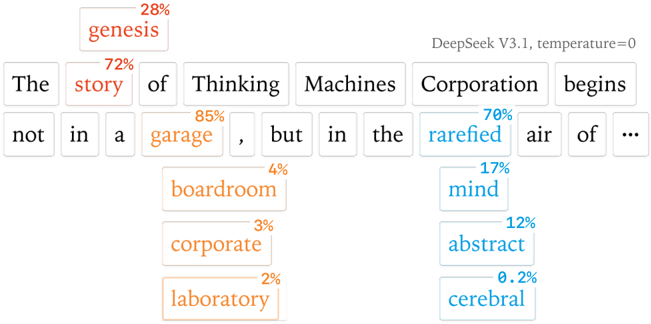
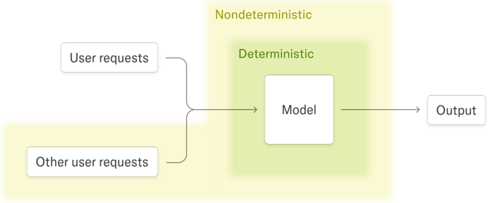
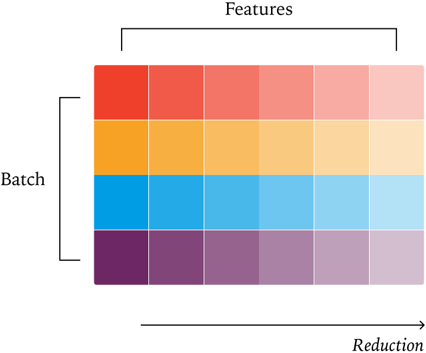
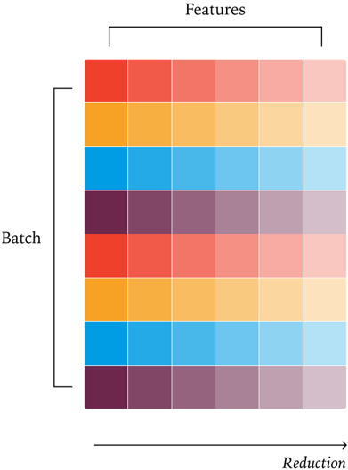
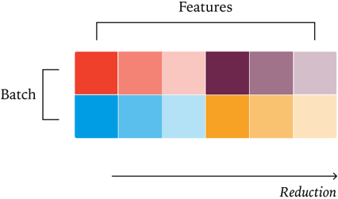
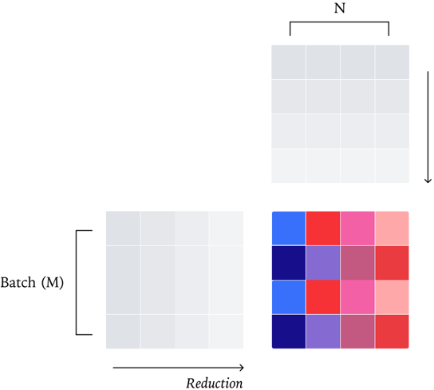
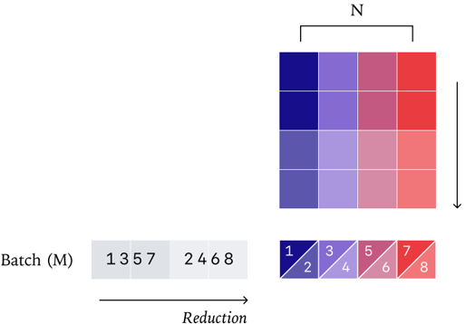
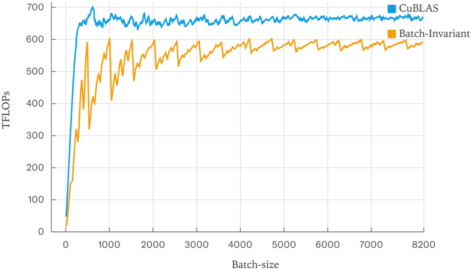
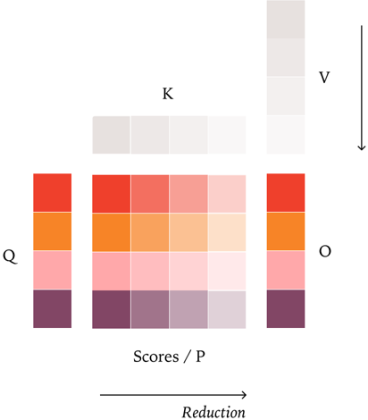
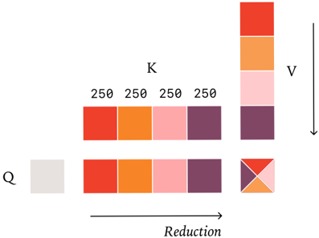

## Defeating Nondeterminism in LLM Inference

Horace He in collaboration with others at Thinking Machines

Sep 10, 2025



Reproducibility is a bedrock of scientific progress. However, it's remarkably difficult to get reproducible results out of large language models.

For example, you might observe that asking ChatGPT the same question multiple times provides different results. This by itself is not surprising, since getting a result from a language model involves 'sampling', a process that converts the language model's output into a probability distribution and probabilistically selects a token.

What might be more surprising is that even when we adjust the temperature down to 0  (thus making the sampling theoretically deterministic), LLM APIs are still not 1

- This means that the LLM always chooses the highest probability token, which is called greedy sampling. 1

deterministic in practice (see past discussions here, here, or here). Even when running inference on your own hardware with an OSS inference library like vLLM or SGLang, sampling still isn't deterministic (see here or here).

But why aren't LLM inference engines deterministic? One common hypothesis is that some combination of floating-point non-associativity and concurrent execution leads to nondeterminism based on which concurrent core finishes first. We will call this the 'concurrency + floating point' hypothesis for LLM inference nondeterminism. For example, a recent arXiv preprint writes:

Floating-point arithmetic in GPUs exhibits non-associativity, meaning due to finite precision and rounding errors. This property directly impacts the ( a + b ) + c =  a +( b + c )

Blog

Join us

computation of attention scores and logits in the transformer architecture, where parallel operations across multiple threads can yield different results based on execution order.

You can also find the 'concurrency + floating point' hypothesis repeated by others, like here ( 'There are speed tradeoffs, and in order to make the endpoints fast GPUs are used, which do parallel [nondeterministic] calculations. Any modern GPU neural net calculations will be subject to these." ), or here ( 'Because GPUs are highly parallelized, the ordering of additions or multiplications might be different on each execution, which can cascade into small differences in output." ).

While this hypothesis is not entirely wrong, it doesn't reveal the full picture. For example, even on a GPU, running the same matrix multiplication on the same data repeatedly will always provide bitwise equal results. We're definitely using floatingpoint numbers. And our GPU definitely has a lot of concurrency. Why don't we see nondeterminism in this test?

```
A = torch.randn(2048, 2048, device='cuda', dtype=torch.bfloat16) B = torch.randn(2048, 2048, device='cuda', dtype=torch.bfloat16) ref = torch.mm(A, B) for _ in range(1000): assert (torch.mm(A, B) - ref).abs().max().item() == 0 python
```

To understand the true cause of LLM inference nondeterminism, we must look deeper.

Unfortunately, even defining what it means for LLM inference to be deterministic is difficult. Perhaps confusingly, the following statements are all simultaneously true:

1. Some kernels on GPUs are nondeterministic .
2. However, all the kernels used in a language model's forward pass are deterministic .
3. Moreover, the forward pass of an LLM inference server (like vLLM) can also be claimed to be deterministic .
4. Nevertheless, from the perspective of anybody using the inference server, the results are nondeterministic .

In this post, we will explain why the 'concurrency + floating point' hypothesis misses the mark, unmask the true culprit behind LLM inference nondeterminism, and explain how to defeat nondeterminism and obtain truly reproducible results in LLM inference.

## The original sin: floating-point non-associativity

Before talking about nondeterminism, it's useful to explain why there are numerical differences at all. After all, we typically think of machine learning models as mathematical functions following structural rules such as commutativity or associativity. Shouldn't there be a 'mathematically correct' result that our machine learning libraries should provide us?

The culprit is floating-point non-associativity. That is, with floating-point numbers:

<!-- formula-not-decoded -->

```
(0.1 + 1e20) - 1e20
```

```
>>> 0 python
```


Ironically, breaking associativity is what makes floating-point numbers useful.

Floating-point numbers are useful because they allow for a 'dynamic' level of precision. For the purposes of explanation, we will use base 10 (instead of binary), where floating-point numbers are in the format . We will also use 3 digits for the mantissa and 1 digit for the exponent. mantissa ∗ 10 exponent

For example, for the value 3450, we can represent it exactly as . We can also represent much smaller values like 0.486 as . In this way, floating point allows us to represent both very small as well as very large values. In the sciences, we might say that floating point allows us to maintain a constant number of 'significant figures'. 3.45 ∗ 10 3 4.86 ∗ 10 -1

If you add together two floating-point numbers with the same exponent, it looks similar to integer addition. For example, 123 ( ) + 456 ( ) results in 579 ( ). 1.23 ∗ 10 2 4.56 ∗ 10 2 5.79 ∗ 10 2

But what happens when we add two floating-point numbers with different exponents, such as 1230 and 23.4? In this case, the exact result is 1253.4. However, we can only maintain 3 digits of precision at a time. Floating-point addition will thus drop the last 2 digits and obtain the value (or 1250). 1.25 ∗ 10 3

Figure 1: We require 3 digits of precision to represent 1230 and 3 digits of precision to represent 23.4. However, adding these 2 numbers together results in a number that requires 5 digits of precision to represent (1253.4). Our floating-point format must then drop the 34 off the end. In some sense, we have effectively rounded our original 23.4 to 20.0 before adding it.


At this point, however, we've destroyed information. Note that this can happen every time we add two floating-point numbers with different 'scales' (i.e. different exponents). And adding together floating-point numbers with different exponents happens all of the time. In fact, if we could guarantee that we never needed different exponents, we could just use integers!

In other words, every time we add together floating-point numbers in a different order, we can get a completely different result. To take an extreme example, there are 102 possible different results for summing this array depending on the order.

```
import random vals = [1e-10, 1e-5, 1e-2, 1] vals = vals + [-v for v in vals] results = [] random.seed(42) python
```

```
for _ in range(10000): random.shuffle(vals) results.append(sum(vals)) results = sorted(set(results)) print(f"There are {len(results)} unique results: {results}") # Output: # There are 102 unique results: [-8.326672684688674e-17, -7.45931094670027e-17, ..., 8.326672684688
```

Although this is the underlying cause for non-identical outputs, it does not directly answer where the nondeterminism comes from. It doesn't help us understand why floating-point values get added in different orders, when that happens, nor how it can be avoided.

The answers lie in how kernels are implemented.

## Why don't kernels always add numbers in the same order?

As mentioned above, one common explanation for why kernels add numbers in different orders is the 'concurrency + floating point' hypothesis. The hypothesis states that if the order in which concurrent threads finish is nondeterministic and the accumulation order depends on the order in which concurrent threads finish (such as with an atomic add), our accumulation order will be nondeterministic as well.

Confusingly, although this can lead to nondeterministic kernels, concurrency (and atomic adds) end up being completely uninvolved in LLM inference nondeterminism! To explain what the real culprit is, let's first understand why modern GPU kernels rarely need atomic adds.

## When are atomic adds needed?

Typically a GPU launches a program concurrently across many 'cores' (i.e. SMs). As the cores have no inherent synchronization among them, this poses a challenge if the cores need to communicate among each other. For example, if all cores must accumulate to the same element, you can use an 'atomic add' (sometimes known as a 'fetch-and-add'). The atomic add is 'nondeterministic' - the order in which the results accumulate is purely dependent on which core finishes first.

Concretely, imagine that you are reducing a 100-element vector with 100 cores (e.g. torch.sum() ). Although you can load all 100 elements in parallel, we must eventually reduce down to a single element. One way to accomplish this is with some kind of 'atomic add' primitive, where the hardware guarantees that all additions will be processed but does not guarantee the order.

Figure 2: The atomic add ensures that every core's contributions will be reflected in the final sum. However, it makes no guarantee about what order the contributions will be added. The order depends entirely on which core finishes first, a nondeterministic property. Thus, executing the same parallel program multiple times can result in nondeterministic outputs.


This is usually what folks mean by 'nondeterminism' - you execute the same kernel twice with exactly the same inputs and you get a different result out. This is known as run-to-run nondeterminism , where you run the same python script twice with the exact same dependencies but get a different result.

Although concurrent atomic adds do make a kernel nondeterministic, atomic adds are not necessary for the vast majority of kernels. In fact, in the typical forward pass of an LLM, there is usually not a single atomic add present.

This may be surprising, given that parallelizing a reduction can benefit from atomic adds. There are two main reasons why atomic adds do not end up being needed.

1. There is often sufficient parallelism along the 'batch' dimension that we don't need to parallelize along the reduction dimension. For example, let's say that instead of reducing a single 100-dim vector we were reducing 500 vectors in parallel. In this case, we can reduce an entire vector in each core and allow every core to operate on a different vector.
2. Over time, most neural network libraries have adopted a variety of strategies for achieving determinism without sacrificing performance. For example, we can perform a 'split' (or tree) reduction, where we split the 100-element reduction into five 20-element reductions (thus achieving five-way parallelism). Then, to combine the remaining five elements, we can either perform a separate 'clean-up' reduction (which isn't parallelized, but operates over few enough elements to be cheap) or utilize a semaphore (which ensures that each concurrent thread-block will accumulate in a deterministic order). 2

The semaphore strategy can be found described here. 2

Due to these two factors, avoiding atomics adds is a negligible performance penalty for the vast majority of neural network operations.

There are still a couple of common operations that have significant performance penalties for avoiding atomics. For example, scatter\_add in PyTorch ( a[b] += c ). The only one commonly used in LLMs, however, is FlashAttention backward. 3

Fun fact: did you know that the widely used Triton implementations of FlashAttention backward actually differ algorithmically from Tri Dao's FlashAttention-2 paper? The standard Triton implementation does additional recomputation in the backward pass, avoiding atomics but costing 40% more FLOPs! 3

However, the forward pass of an LLM involves no operations that require atomic adds. Thus, the forward pass in an LLM is in fact 'run-to-run deterministic.'

Figure 3: From the perspective of the inference server, it is deterministic. Given the exact same user requests, it will always provide the same deterministic output.


Wikipedia writes that 'a deterministic algorithm is an algorithm that, given a particular input, will always produce the same output.' And in this case, given the exact same inputs (i.e. the exact requests the inference server is processing), the forward pass always produces the exact same outputs.

However, the forward pass itself being 'deterministic' is not sufficient to ensure that a system that includes it is deterministic. For example, what if our request's output depended on the parallel user requests (e.g. batch-norm)? Since each individual request has no way of knowing what the parallel requests will be, from their perspective our overall LLM inference is also nondeterministic!

As it turns out, our request's output does depend on the parallel user requests. Not because we're somehow leaking information across batches - instead, it's because our forward pass lacks 'batch invariance', causing our request's output to depend on the batch size of our forward pass.

## Batch invariance and 'determinism'

To explain batch invariance, let's simplify the system and look solely at matmuls. You can assume that all matmul implementations are 'run-to-run deterministic."  However, 4

This is not totally true, but most common matmul implementations do have this property. 4

they are not 'batch-invariant.' In other words, when the batch size changes, each element in the batch can get different results.

This is a fairly unusual property from a mathematical perspective. Matrix multiplication should be 'independent' along every element in the batch - neither the other elements in the batch nor how large the batch is should affect the computation results of a specific element in the batch.

However, as we can observe empirically, this isn't true.

python

```
import torch torch.set_default_device('cuda') B = 2048 D = 4096 a = torch.linspace(-1000, 1000, B*D).reshape(B, D) b = torch.linspace(-1000, 1000, D*D).reshape(D, D) # Doing a matrix vector multiplication by taking # the first element of the batch out1 = torch.mm(a[:1], b) # Doing a matrix matrix multiplication and then taking # the first element of the batch out2 = torch.mm(a, b)[:1] print((out1 - out2).abs().max()) # tensor(1669.2500, device='cuda:0')
```

Note that this is 'run-to-run deterministic.' If you run the script multiple times, it will deterministically return the same result. 5

It is not 'hardware/software version invariant' - your GPU/PyTorch version may return a different value, but it should deterministically return the same value. 5

However, when a non-batch-invariant kernel is used as part of a larger inference system, the system can become nondeterministic. When you make a query to an inference endpoint, the amount of load the server is under is effectively 'nondeterministic' from the user's perspective. The load determines the batch size that the kernels are run under, and thus changes the eventual result of each individual request!

Figure 4: Although the inference server itself can be claimed to be "deterministic", the story is different for an individual user. From the perspective of an individual user, the other concurrent users are not an "input" to the system but rather a nondeterministic property of the system. This makes LLM inference "nondeterministic" from the perspective of each user.



If you compose some property under which the kernel is not invariant (i.e. batch-size) with nondeterminism of that property (i.e. the load the server is under), you get a nondeterministic system.

In other words, the primary reason nearly all LLM inference endpoints are nondeterministic is that the load (and thus batch-size) nondeterministically varies! This nondeterminism is not unique to GPUs - LLM inference endpoints served from CPUs or TPUs will also have this source of nondeterminism.

So, if we'd like to avoid nondeterminism in our inference servers, we must achieve batch invariance in our kernels. In order to understand how that can be achieved, let's

first take a look at why kernels don't have batch invariance in the first place.

## How do we make kernels batch-invariant?

In order to make a transformer implementation batch-invariant, we must make every kernel batch-invariant. Luckily, we can assume that every pointwise operation is batchinvariant.  Thus, we only need to worry about the 3 operations that involve reductions 6

Although this is true for all kernels in say, PyTorch, it's not inherently true. For example, there are some kernel implementations on CPU that will use vectorized intrinsics on some parts of the array and non-vectorized intrinsics on other parts, and these intrinsics don't necessarily always have bitwise identical numerics. 6

- RMSNorm, matrix multiplication, and attention. 7

Reductions related to parallelism are out of the scope of this discussion, but the same principles apply. One factoid that may be useful is that NVLink-Sharp in-switch reductions are deterministic on Blackwell as well as Hopper with CUDA 12.8+. As is the case with many things, this information can be found on NCCL 's github issues 7

Conveniently, these are also ordered in ascending levels of difficulty. Each one requires some additional considerations to achieve batch invariance with reasonable performance. Let's talk about RMSNorm first.

## Batch-invariant RMSNorm



Figure 5: Data Parallel RMSNorm Ideally, we'd like to avoid communication between cores in our parallelization strategy. One way to achieve that is by assigning one batch-element to each core, thus guaranteeing that each reduction is done entirely within a single core. This is what's known as a "dataparallel" strategy, since we're simply parallelizing along a dimension that doesn't require communication. In this example, we have four rows and four cores, saturating our cores.

## RMSNorm can be implemented as:

python

```
# x: [batch_size, hidden_dim] # weight: [hidden_dim] def rms_norm(x, weight): return x * torch.rsqrt(torch.mean(x ** 2, dim=-1, keepdim=True)) * weight
```

The requirement for batch invariance is that the reduction order for each element must be fixed regardless of the batch-size of the kernel. Note that this doesn't mean we must always use the same reduction strategy. For example, if we change the

number of elements we're reducing over, we can still be batch-invariant even if our 8

reduction strategy changes.

The Quack blog post has some nice examples showing the hierarchy of various reduction strategies you can do (e.g. thread reduction, warp reduction, block reduction, cluster reduction). 8

Thus, we only break batch invariance when our batch-size affects the reduction strategy.

Let's look at the standard parallelism strategy for RMSNorm. Generally, parallel algorithms benefit from minimizing communication across cores.   So, one strategy we 9

For the purpose of this discussion you can assume that when we refer to 'cores' we mean SMs. More specifically, the property here that's important is that the # of threadblocks our kernel launches is greater than the # of SMs. 9

can start with is to assign each batch element to one core, as seen in the above figure.

Increasing our batch size doesn't affect our reduction strategy; if a batch size of 200 provides sufficient parallelism to our kernel then a batch size of 2000 will definitely provide sufficient parallelism.

Figure 6: Data Parallel RMSNorm for larger batches Extending the data-parallel strategy to larger batches is fairly straightforward --- instead of having each core handle one row you allow each core to handle different rows sequentially. This preserves batch invariance as the reduction strategy for each batch element remains identical.



On the other hand, decreasing the batch size can pose challenges. Because we assign each batch element to one core, decreasing our batch size will eventually lead to having more cores than batch elements, leaving some cores idle.

Upon encountering this situation, a good kernel engineer would reach for one of the solutions mentioned in the prior section (atomic adds or split reductions), maintaining good parallelism and thus, good performance. Unfortunately, this changes the reduction strategy, preventing this kernel from being batch-invariant.

Figure 7: Split-Reduction RMSNorm If we have a small batch size, our data-parallel strategy may no longer have sufficient parallelism to saturate our cores. In this case, it may be more efficient to "split" a reduction among multiple cores, allowing us to fully utilize our GPU. However, this loses batch invariance, as we are no longer reducing each element in the same order.



The easiest solution is to simply ignore these cases altogether. This is not completely unreasonable - a small batch size means that the kernel is likely to execute quickly anyways, and so a slowdown may not be catastrophic.

If we were compelled to optimize this use case, one approach would be to consistently use a reduction strategy that has enough parallelism even for very small batch sizes. Such a reduction strategy would lead to an excess amount of parallelism for larger batch sizes but would allow us to achieve decent (but not peak) performance across the entire range of sizes.

## Batch-invariant matrix multiplication

Figure 8: Data Parallel Matmul Similar to RMSNorm, the standard parallelism strategy for matmuls is a "data-parallel" strategy, keeping the entire reduction in one core. It is most straightforward to think about splitting the output tensor into 2D tiles and assigning each tile to a different core. Each core then computes the dot products that belong to that tile, once again performing the entire reduction within one core.



Unlike for RMSNorm, additional constraints around arithmetic intensity and utilizing tensorcores force us to split 2D tiles instead of individual output elements for efficient matmul kernels.

At its core, you can view matrix multiplication as simply a pointwise operation followed by a reduction. Then, if we parallelize our matrix multiplication by chunking the output into tiles, we have an analogous 'data-parallel' kernel strategy that keeps each reduction within one core.

Also similar to RMSNorm, it is possible for our 'batch' dimensions (M and N) to become too small, forcing us to split along the reduction dimension (K). Despite having two 'batch' dimensions, matmuls also require us to have much more 'work' per core in order to leverage tensorcores effectively. For example, if you have a [1024, K] x [K, 1024] matmul and a standard 2D tile size of [128, 128], a data-parallel strategy would only be able to split this matmul into 64 cores, insufficient to saturate the GPU.

Splitting along the reduction dimension in a matmul is known as a Split-K Matmul. And just like RMSNorm, using this strategy breaks batch invariance. 10

Another interesting parallelism strategy for matmuls is stream-k. Stream-k is interesting because it has even less invariance than typical matmuls. As discussed, most matmul libraries are not batch-invariant, but they're at least what you could call batch-position-invariant (i.e. changing the position of the element within the batch does not affect numerics). However, stream-k is not batch-position-invariant either! Its core insight is that you can get cleaner load-balancing by splitting along k in different ways for different output tiles, but taking advantage of this makes our kernel not batch-position-invariant either. 10

Figure 9: Split-K Matmul If our batch dimension is fairly small we may not have enough parallelism and require a split-k matmul. In this example, we split each reduction across two cores, which would accumulate separately and then combine their results at the end. However, splitting each reduction across two cores allows us to still leverage eight cores.



There's an additional complexity with matmuls - tensor core instructions. Whereas with reductions we could simply operate on one row at a time, efficient matrix multiplication kernels must operate on an entire 'tile' at a time.

Each tensor-core instruction (like say, wgmma.mma\_async.sync.aligned.m64n128k16 ) may have a different reduction order internally. One reason to use a different tensor-core instruction might be that the batch size is very small. For example, if we use a tensor-core PTX instruction that operates on a tile of length 256 but the batch size is only 32, we're wasting almost all of that compute! At a batch-size of 1, the fastest kernels usually don't use tensor cores at all.

Figure 10: Padded Tensor-Core Instructions If the batch size is too small, we may be in our situation where we can't fit even one of our 2D tiles in the output. In this case, it is most efficient to switch to a smaller tensor-core instruction or eschew tensor-cores altogether! However, both of these options prevent our kernel from being batch-invariant.


So, the easiest way to ensure batch invariance for matmuls is to compile one kernel configuration and use that for all shapes. Although we will lose some performance, this isn't typically disastrous in LLM inference. In particular, split-k is most needed when both M and N are small, and luckily in our case, N (i.e. the model dim) is usually pretty large!

Figure 11: Despite obtaining batch invariance, we only lose about 20% performance compared to cuBLAS. Note that this is not an optimized Triton kernel either (e.g. no TMA). However, some of the patterns in performance are illustrative of where our batch-invariant requirement loses performance. First, note that we lose a significant amount of performance at very small batch sizes due to an overly large instruction and insufficient parallelism. Second, there is a "jigsaw" pattern as we increase the batch-size that is caused by quantization effects (both tile and wave) that are typically ameliorated through changing tile sizes. You can find more on these quantization effects here.



## Batch-invariant attention

Figure 12: FlashAttention2 Strategy We parallelize along Q, and reduce along K/V simultaneously. This means that our entire reduction can be kept within a single core, making it another data-parallel strategy.



After obtaining batch invariance for matmuls, attention introduces two additional wrinkles - fittingly, because it contains two matmuls.

1. As opposed to only reducing over the feature dimension like both RMSNorm and matmuls, we now reduce over the feature dimension and sequence dimension.
2. Due to the above, attention must deal with a variety of inference optimizations that affect how sequences get processed (chunked prefill, prefix caching, etc.).

Thus, to achieve determinism in LLM inference our numerics must be invariant to both how many requests are processed at once and how each request gets sliced up in the inference engine.

Let's first walk through the standard parallelism strategy for attention, first introduced in FlashAttention2. Similar to RMSNorm and Matmul, the default strategy is a 'dataparallel' strategy. Since we reduce along the key/value tensors, a data-parallel strategy can only parallelize along the query tensor.

For example, depending on the inference engine's choices, it's possible that a sequence might get processed in several parts (such as in chunked prefill) or perhaps all at once (if the prefill isn't split up). In order to achieve 'batch invariance', it's necessary that the reduction order for a given token does not depend on how many other tokens from its sequence are being simultaneously processed . If you reduce over the K/V values in the KV cache separately from the K/V values in the current tokens being processed (like in vLLM's Triton attention kernel), this can't be achieved. For example, when processing the 1000th query token in a sequence, the reduction order must be identical regardless of whether 0 tokens are in the KV cache (prefill) or 999 tokens are in the KV cache (decoding).

Figure 13: FlashAttention with a KV Cache The reason why explicitly handling the KV cache separately from the current KV values breaks batch invariance is a bit subtle and is related to "boundary conditions". In particular, imagine your block size is 32 but we currently have 80 elements in our KV cache. We then compute an additional 48 elements that aren't cached. In this case, we need three blocks (two full and one masked) to compute "P cache" and another two blocks (one full and one masked) to compute "P". This is therefore five total blocks to compute our reduction when we only have four total blocks (i.e. 128) of elements to compute, which will definitely change our reduction order.


For example, if we instead had no elements in our KV Cache and were processing 128 elements altogether, we need to have identical numerics in both of these situations to ensure 'batch invariance' for attention.

To resolve this, we can just update the KV cache and page table before the attention kernel itself, ensuring that our keys and values are always consistently laid out regardless of how many tokens are being processed.

With this additional detail (as well as all the things mentioned in the previous section, like consistent tile sizes), we are able to achieve a batch-invariant attention implementation!

However, there is a significant problem here. Unlike with matrix multiplication, the attention shapes we see in LLM inference often do require a split-reduction kernel, often known as Split-KV or FlashDecoding. This is because if we don't parallelize along the reduction, we can only parallelize along the batch dimension, head dimension, and 'query length' dimension. In the decode stage of attention, query length is very small, and so unless we have a very large batch size we are often unable to saturate the GPU.

Unfortunately, it's not as easy to ignore this case as it was for RMSNorm and Matmuls. For example, if you have a very long KV cache, the attention kernel may take a very long time despite only processing one request.

Figure 14: Fixed # Split-KV Strategy (i.e. FlashDecode) If our query length becomes very small (like it does during decoding), we may end up in a situation where there is very little parallelism in our kernel at all. In these cases, we'll need to once again split along the reduction dimension --- the KV dimension this time. The typical strategy for how to split along the KV dimension is to figure out how much parallelism we need and then divide the KV dimension evenly. For example, if our KV length was 1000 and we needed 4 splits, each core would handle 250 elements.



This unfortunately also breaks batch invariance, as our precise reduction strategy depends on how many query tokens from the sequence we're processing in any given request.

Furthermore, the split-reduction strategies commonly used for attention also pose challenges for batch invariance. For example, FlashInfer's 'balanced scheduling algorithm' chooses the largest split-size that can still saturate all the GPU's cores, thus making the reduction strategy not 'batch-invariant'. However, unlike with RMSNorm/Matmuls, it's not sufficient to choose a fixed number of splits regardless of the batch size.

Instead, to achieve batch invariance, we must adopt a 'fixed split-size' strategy. In other words, instead of fixing the # of splits, we fix the size of each split and then end up with a varying number of splits. In this manner, we can guarantee that regardless of how many tokens we're processing, we always perform the identical reduction order. 11

This requires some internal FlexAttention changes that are not included in our code release. We will upstream them in the near future! 11

Figure 15: Fixed Size Split-KV Strategy The only difference between this strategy and the previous strategy is that our splits are now "fixed size". For example, if our KV length was 1000, instead of splitting it into four even length 250 splits, we would split it into three fixed-size length 256 splits and one length 232 split.


This allows us to preserve batch invariance as our reduction strategy is no longer dependent on how many query tokens we're processing at once!

## Implementation

We provide a demonstration of deterministic inference on top of vLLM by leveraging its FlexAttention backend as well as torch.Library. Through torch.Library, we're able to substitute out most of the relevant PyTorch operators in an unintrusive way. You can find the library of 'batch-invariant' kernels at thinking-machines-lab/batch-invariantops, as well as the vLLM example of running in 'deterministic' mode.

## Experiments

## How nondeterministic are completions?

We use Qwen/Qwen3-235B-A22B-Instruct-2507 and sample 1000 completions at temperature 0 with the prompt 'Tell me about Richard Feynman' (non-thinking mode), generating 1000 tokens each. Surprisingly, we generate 80 unique completions, with the most common of these occuring 78 times.

Looking at where the completions differ, we see that the completions are actually identical for the first 102 tokens! The first instance of diverging completions occurs at the 103rd token. All completions generate the sequence 'Feynman was born on May 11, 1918, in' However, 992 of the completions go on to generate 'Queens, New York' whereas 8 of the completions generate 'New York City'.

On the other hand, when we enable our batch-invariant kernels, all of our 1000 completions are identical. This is what we would mathematically expect from our sampler, but we aren't able to achieve deterministic results without our batch-invariant kernels.

## Performance

We have not put a significant effort into optimizing the performance of the batchinvariant kernels here. However, let's run some experiments to verify that our performance remains usable.

We will set up an API server with one GPU running Qwen-3-8B, and request 1000 sequences with an output length of between 90 and 110.

| Configuration                  |   Time (seconds) |
|--------------------------------|------------------|
| vLLM default                   |               26 |
| Unoptimized Deterministic vLLM |               55 |
| + Improved Attention Kernel    |               42 |

Much of the slowdown comes from the fact that the FlexAttention integration in vLLM has not been heavily optimized yet. Nevertheless, we see that performance is not disastrous .

## True on-policy RL

As researchers have noted, the different numerics between training and inference implicitly turns our on-policy RL into off-policy RL.

Of course, it is impossible to get bitwise identical results between training and inference if we can't even get bitwise identical results from two identical inference requests. Then, deterministic inference enables us to also modify our training stack to obtain bitwise identical results between sampling and training, thus resulting in true on-policy RL.

We run experiments in a RLVR setup on Bigmath with the RL policy initialized from the Qwen 2.5-VL instruct 8B with a max rollout length of 4096.

If we train without off-policy correction (i.e. importance weighting), our reward collapses partway through training, whereas adding an off-policy correction term allows training to proceed smoothly. But, if we achieve bitwise identical results between our sampler and trainer, we are fully on policy (i.e. 0 KL divergence) and can also train smoothly.

We can also plot the KL-divergence in logprobs between our sampler and trainer, where all 3 runs have notably different behavior. When running with importance weighting, it stays around 0.001 with occasional spikes. However, running without importance weighting eventually leads to a spike in KL-divergence around the same time that reward crashes. And, of course, when running 'True On-Policy RL ', our KLdivergence stays flat at 0, indicating that there is no divergence between the training policy and sampling policy.

Figure 16: Note that the run without importance weighting has a significant loss spike around Step 318, and this comes with a correspond ing spike in KL-divergence of logprobs. Meanwhile, either using an off-policy correction or running with "True On-Policy" allows RL to continue smoothly. The blue line showing "True On-Policy" is not a bug - it's just a flat line at 0.


## Conclusion

Modern software systems contain many layers of abstractions. In machine learning, when we run into nondeterminism and subtle numerical differences it can often be tempting to paper over them. After all, our systems are already 'probabilistic', so what's wrong with a little more nondeterminism? What's wrong with bumping up the

atol/rtol on the failing unit test? The difference in logprobs between the trainer and the sampler probably isn't a real bug, right?

We reject this defeatism. With a little bit of work, we can understand the root causes of our nondeterminism and even solve them! We hope that this blog post provides the community with a solid understanding of how to resolve nondeterminism in our inference systems and inspires others to obtain a full understanding of their systems.

## Citation

## Please cite this work as:

He, Horace and Thinking Machines Lab, "Defeating Nondeterminism in LLM Inference", Thinking Machines Lab: Connectionism, Sep 2025.

## Or use the BibTeX citation:

```
@article{he2025nondeterminism, author = {Horace He and Thinking Machines Lab}, title = {Defeating Nondeterminism in LLM Inference}, journal = {Thinking Machines Lab: Connectionism}, year = {2025}, note = {https://thinkingmachines.ai/blog/defeating-nondeterminism-in-llm-inference/}, doi = {10.64434/tml.20250910} }
```

back to top

©   2025 · · Thinking Machines Lab Terms of service Privacy notice